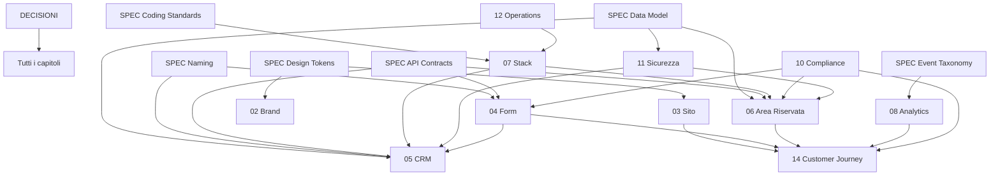

# 00. Master Index - Bibbia di Progetto

Progetto: **Successioni Online - Studio Geom. Lorenzo Armellin (Pontedera, PI)**
Documento maestro che indicizza e governa l'intera "Bibbia" del progetto.

---

## Scopo della Bibbia

Documentare ogni aspetto del progetto (business, UX, tecnico, legale, marketing)
in file Markdown modulari, da "congelare" un capitolo alla volta prima di scrivere
codice. Obiettivo: azzerare lo "scope creep" e fornire all'AI istruzioni chiuse e
verificabili in fase di sviluppo.

## Come usarla con l'AI (metodo modulare)

1. Si lavora **un capitolo (o un sotto-tema) alla volta**.
2. Quando si scrive un capitolo, si dà come contesto solo questo README + i file
   strettamente necessari (vedi "Dipendenze" nei metadati di ciascun capitolo).
3. Una volta validato, il capitolo passa a stato **Congelato** e diventa la "legge"
   per lo sviluppo.
4. Le scelte chiuse vanno sempre registrate nella sezione "Decisioni congelate".

## Convenzioni

- Naming file: `NN_Titolo_Capitolo.md` (prefisso numerico per l'ordinamento).
- Lingua: italiano.
- Ogni file segue il **Template standard** qui sotto.
- I riferimenti incrociati usano la sintassi `@NN_Nome` nelle dipendenze.

## Legenda Stati

| Stato | Significato |
|-------|-------------|
| Bozza | Contenuto iniziale, ancora da definire |
| In revisione | Completo ma da validare |
| Congelato | Validato, immutabile salvo motivazione esplicita |

## Stato globale del progetto

| Cap | Titolo | Stato | Ultimo agg. |
|-----|--------|-------|-------------|
| 01 | Executive Summary e Visione | In revisione | 2026-06-21 |
| 02 | Brand Identity e Psicologia | In revisione | 2026-06-22 |
| 03 | Architettura Informazione (Sito) | In revisione | 2026-06-22 |
| 04 | Form Multi-step / Conversione | In revisione | 2026-06-22 |
| 05 | CRM e Workflow di Lorenzo | In revisione | 2026-06-22 |
| 06 | Area Riservata Cliente | In revisione | 2026-06-22 |
| 07 | Stack Tecnologico e Infrastruttura | In revisione | 2026-06-22 |
| 08 | Tracciamento e Analytics | In revisione | 2026-06-18 |
| 09 | Go-To-Market (SEO e ADV) | In revisione | 2026-06-22 |
| 10 | Legale e Compliance | In revisione | 2026-06-22 |
| 11 | Sicurezza | In revisione | 2026-06-22 |
| 12 | Operations e Manutenzione | In revisione | 2026-06-20 |
| 13 | Stima Costi e Roadmap | In revisione | 2026-06-22 |
| 14 | Customer Journey del Cliente (trasversale) | In revisione | 2026-06-19 |

## Indice dei capitoli

- [01. Executive Summary e Visione](01_Executive_Summary_e_Visione.md)
- [02. Brand Identity e Psicologia](02_Brand_Identity_e_Psicologia.md)
- [03. Architettura dell'Informazione (Sito)](03_Architettura_Informazione_Sito.md)
- [04. Form Multi-step / Motore di Conversione](04_Form_Multistep_Conversione.md)
- [05. CRM e Workflow di Lorenzo](05_CRM_e_Workflow_Lorenzo.md)
- [06. Area Riservata Cliente](06_Area_Riservata_Cliente.md)
- [07. Stack Tecnologico e Infrastruttura](07_Stack_Tecnologico_e_Infrastruttura.md)
- [08. Tracciamento e Analytics](08_Tracciamento_Analytics.md)
- [09. Go-To-Market (SEO e ADV)](09_Go_To_Market_SEO_ADV.md)
- [10. Legale e Compliance](10_Legale_Compliance.md)
- [11. Sicurezza](11_Sicurezza.md)
- [12. Operations e Manutenzione](12_Operations_e_Manutenzione.md)
- [13. Stima Costi e Roadmap](13_Stima_Costi_e_Roadmap.md)
- [14. Customer Journey del Cliente (capitolo trasversale: cuce @03/@04/@06/@08/@10)](14_Customer_Journey_Cliente.md)

## Documenti di supporto

- [STRUTTURA_CONTENUTI_SITO.md](STRUTTURA_CONTENUTI_SITO.md) - scheletro di ogni pagina/blocco del sito con testi SEGNAPOSTO [BOZZA]; base da cui deriva il registro tecnico dei blocchi e che guida design/sviluppo. Naming `collection.key` allineato a content_entries (@SPEC_Data_Model). Bozza completa: tutte le pagine pubbliche mappate.
- [RIFERIMENTO_Successioni_Modello_e_Normativa.md](RIFERIMENTO_Successioni_Modello_e_Normativa.md) - fonte di DOMINIO: modello aggiornato della dichiarazione di successione, autoliquidazione 2025, imposte/franchigie, termini, normativa e link ai canali ufficiali (AdE, Normattiva); include la **mappa dei quadri del Modello -> nostri campi** e un **caso-studio anonimo** (da esempio reale di Lorenzo). Alimenta @04/@06/@09/@10.
- [DOMANDE_PER_LORENZO.md](DOMANDE_PER_LORENZO.md) - informazioni da raccogliere dal Geom. Armellin in riunione (sblocca i nodi aperti nei vari capitoli).
- [ANALISI_COMPETITORS.md](ANALISI_COMPETITORS.md) - mappa dei competitor italiani, griglia di valutazione, domande per la riunione e analisi del naming.
- [DECISIONI.md](DECISIONI.md) - vincoli congelati aggregati (PRIMO file da dare in pasto all'AI).
- [GESTIONE_PROGETTO.md](GESTIONE_PROGETTO.md) - fasi di release, step e gate di approvazione (incl. prototipi sito/CRM).

## SPEC canoniche (Single Source of Truth)

Fonti di verita uniche: i capitoli le LINKANO, non duplicano i valori. Da allegare ai prompt di sviluppo.

- [SPEC_Data_Model.md](SPEC_Data_Model.md) - schema, enum, relazioni, RLS.
- [SPEC_Naming_Conventions.md](SPEC_Naming_Conventions.md) - nomi esatti (tabelle, rotte, eventi, job, env).
- [SPEC_API_Contracts.md](SPEC_API_Contracts.md) - endpoint/server action e schemi Zod.
- [SPEC_Design_Tokens.md](SPEC_Design_Tokens.md) - colori, tipografia, spaziature.
- [SPEC_Event_Taxonomy.md](SPEC_Event_Taxonomy.md) - eventi e parametri di tracciamento.
- [SPEC_Content_Blocks.md](SPEC_Content_Blocks.md) - registro tecnico dei blocchi di contenuto editabili (`collection.key` + tipo + default), agganciato a content_entries. Derivato da STRUTTURA_CONTENUTI_SITO. Seed dati: `seed/content_entries.it.json` (232 voci IT).
- [SPEC_Env_Vars.md](SPEC_Env_Vars.md) - variabili d'ambiente per servizio.
- [SPEC_Coding_Standards.md](SPEC_Coding_Standards.md) - regole per codice pulito e uniforme.
- [SPEC_UX_e_Principi_Guida.md](SPEC_UX_e_Principi_Guida.md) - regole auree, estetica, UX/UI, mobile-first e interazioni (manifesto/blueprint tecnico iniziale).

Regola anti-drift: NON duplicare valori condivisi (nomi, enum, token, eventi); linkare sempre la SPEC corrispondente.

## Grafo delle dipendenze



## Template standard (da copiare in ogni capitolo)

```
## Metadati
- ID: CAP-NN
- Stato: Bozza
- Ultimo aggiornamento: AAAA-MM-GG
- Dipendenze: @NN_Nome
- Owner:

## Sintesi
(1 paragrafo: a cosa serve questo capitolo)

## Stato attuale del progetto
(Cosa e gia definito/deciso ad oggi)

## Idee future
(Funzioni e migliorie da valutare piu avanti)

## Nodi da sciogliere
(Domande aperte e decisioni mancanti che bloccano l'avanzamento)

## Passi successivi
(Azioni concrete e ordinate per chiudere il capitolo)

## Decisioni congelate (lock-in)
(Scelte chiuse: non rimetterle in discussione senza motivazione esplicita)

## Rischi / Compliance & Riferimenti
(Vincoli normativi, rischi, link a fonti e ad altri capitoli)
```

## Glossario rapido

- **Successione**: trasferimento del patrimonio del defunto agli eredi.
- **Dichiarazione di successione**: adempimento fiscale telematico verso l'Agenzia delle Entrate.
- **Voltura catastale**: aggiornamento dell'intestazione degli immobili in catasto.
- **Autoliquidazione** (dal 2025, D.Lgs. 139/2024): l'imposta di successione e calcolata e versata dal contribuente (quadro EF, F24).
- **Entratel**: piattaforma dell'Agenzia delle Entrate per la trasmissione telematica; richiede abilitazione come intermediario.
- **Franchigia**: soglia esente da imposta in base al grado di parentela.
- **E-E-A-T**: Experience, Expertise, Authoritativeness, Trust (criterio di qualita Google).
- **YMYL**: "Your Money or Your Life", categoria di contenuti ad alto scrutinio da parte di Google.
- **RLS**: Row Level Security (isolamento dei dati a livello di riga del database).
- **OTP**: One Time Password (accesso passwordless).
- **DPA**: Data Processing Agreement (accordo con i responsabili del trattamento).
- **DPIA**: Data Protection Impact Assessment (valutazione d'impatto privacy).
- **CMP**: Consent Management Platform (banner cookie/consensi).

## Riferimenti normativi principali

> Sintesi operativa e link ufficiali nel documento di dominio: [RIFERIMENTO_Successioni_Modello_e_Normativa.md](RIFERIMENTO_Successioni_Modello_e_Normativa.md).

- D.Lgs. 139/2024 - riforma imposte indirette (autoliquidazione successioni).
- Circolare Agenzia delle Entrate n. 3/E del 16 aprile 2025.
- Provv. Agenzia delle Entrate n. 42444/2017 - abilitazione geometri alla trasmissione telematica.
- D.Lgs. 206/2005 (Codice del Consumo), artt. 52-59 - diritto di recesso.
- Reg. UE 2016/679 (GDPR).
