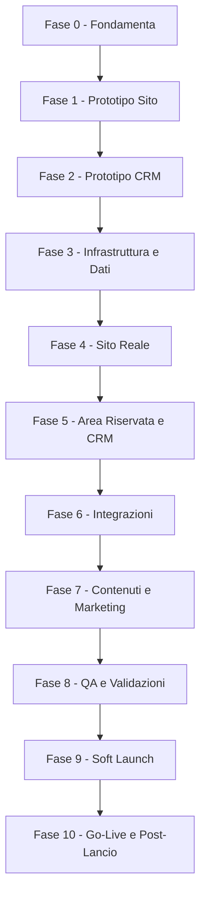

# Gestione Progetto - Fasi di Release e Step

> Piano di esecuzione a fasi con punti di approvazione (gate). Complementare al @13_Stima_Costi (che definisce l'ORDINE TECNICO di sviluppo): qui si governa il COME e QUANDO si rilascia, con prototipi e validazioni prima del go-live.
> Stato: In revisione · Ultimo aggiornamento: 2026-06-22
> Riferimenti: @13 (roadmap dev), @11 (sicurezza), @12 (operations), @10 (legale), DECISIONI.
> Diario di sviluppo (cronologia, dettagli e step operativi): vedi sezione "Diario di sviluppo" in fondo a questo documento.

## Principio dei "gate" (go / no-go)
Ogni fase ha un obiettivo, dei deliverable e un **criterio di uscita** che deve essere approvato prima di passare alla fase successiva. Questo evita di costruire sul vuoto e di scoprire problemi tardi.

## Legenda stati fase
- Da iniziare | In corso | In attesa di approvazione | Approvata

## Ruoli
- Lorenzo: fornisce informazioni, approva ai gate (contenuti, design, UX, legale, prezzi).
- Sviluppo (tu + AI): costruisce, testa, documenta.

## Flusso delle fasi

---

## Fase 0 - Fondamenta e raccolta info
- Obiettivo: avere tutti i prerequisiti prima di costruire.
- Deliverable: risposte di DOMANDE_PER_LORENZO; conferma abilitazione Entratel; incarico legale (privacy/T&C/DPIA, @10); asset brand (logo/foto) e shooting (@02/@09).
- Gate di uscita: prerequisiti legali e informativi raccolti; brand approvato.
- Stato: In corso

## Fase 1 - Prototipo Sito (validazione UX/design/copy)
- Obiettivo: validare esperienza, design e testi del sito pubblico PRIMA dello sviluppo completo.
- Deliverable: prototipo multipagina navigabile (home, tariffe, chi sono, form, FAQ) con contenuti reali ma senza backend.
- Tecnologia prototipo: DECISO -> mockup in Next.js + dati finti (evolve nel prodotto reale, no lavoro buttato).
- Gate di uscita: Lorenzo approva layout, flusso e copy.
- Stato: In corso - prototipo costruito e su GitHub; deploy Vercel da finalizzare (vedi Diario 2026-06-21). In attesa validazione Lorenzo.

## Fase 2 - Prototipo CRM (validazione flusso/usabilita)
- Obiettivo: validare interfaccia e flusso del CRM con dati finti.
- Deliverable: mockup di Kanban, scheda lavoro, anagrafica/storico, dashboard KPI (dati simulati).
- Gate di uscita: Lorenzo approva l'usabilita e conferma colonne/azioni/viste.
- Stato: In corso - prototipo costruito (Home operativa, Pipeline Kanban/Lista, Scheda pratica, Contatti, Statistiche) e su GitHub (vedi Diario 2026-06-22). In attesa validazione Lorenzo.

## Fase 3 - Infrastruttura e Dati
- Obiettivo: basi tecniche pronte (@13 step 1-3).
- Deliverable: ambienti dev/staging/prod, Supabase UE, schema + RLS + test cross-tenant, auth admin (2FA) e client passwordless.
- Gate di uscita: RLS testata (nessuna fuga cross-tenant, @11); CI/CD attiva.
- Stato: Da iniziare

## Fase 4 - Sito Reale
- Obiettivo: sito pubblico in produzione tecnica (non ancora pubblicizzato).
- Deliverable: pagine reali (da prototipo), form multi-step -> lead in DB + eventi GA4, checkout Stripe + webhook, pagine legali + CMP.
- Gate di uscita: flusso lead->pagamento funzionante in test; consensi e Consent Mode attivi (@08/@10).
- Stato: Da iniziare

## Fase 5 - Area Riservata e CRM
- Obiettivo: parte operativa funzionante.
- Deliverable: area cliente (upload/dashboard/download signed URL), CRM (Kanban, scheda lavoro, contacts/storico, validazione documenti, automazioni email, dashboard KPI base).
- Gate di uscita: ciclo completo pratica end-to-end in staging.
- Stato: Da iniziare

## Fase 6 - Integrazioni
- Obiettivo: automazioni complete.
- Deliverable: WhatsApp (se in v1), offline conversions, job/cron con retry, Looker Studio embeddato, Sentry.
- Gate di uscita: automazioni con retry verificate; alert attivi (@12).
- Stato: Da iniziare

## Fase 7 - Contenuti e Marketing
- Obiettivo: il "negozio" e pronto a ricevere traffico.
- Deliverable: 5 pillar article (accurati su autoliquidazione), schema.org, Google Business Profile, 20 recensioni iniziali, campagne Ads configurate (non ancora attive).
- Gate di uscita: contenuti pubblicati; tracciamento conversioni validato (@08).
- Stato: Da iniziare

## Fase 8 - QA e Validazioni
- Obiettivo: qualita e conformita prima del pubblico.
- Deliverable: checklist QA (@13), security review (@11), UAT con Lorenzo su dati reali, validazione legale finale, restore di prova del DB.
- Gate di uscita: checklist QA superata; legale approvato; backup/restore ok.
- Stato: Da iniziare

## Fase 9 - Soft Launch
- Obiettivo: validare in condizioni reali su scala ridotta.
- Deliverable: sito live con traffico limitato (budget Ads ridotto / cerchia ristretta); monitoraggio attivo.
- Gate di uscita: nessun bug bloccante; primi lead/pratiche gestiti correttamente.
- Stato: Da iniziare

## Fase 10 - Go-Live e Post-Lancio
- Obiettivo: lancio ufficiale e miglioramento continuo.
- Deliverable: scaling Ads sui dati (@09), manutenzione (@12), avvio funzioni fase 2 (OCR, export gestionale, ROI avanzato).
- Gate di uscita: -
- Stato: Da iniziare

---

## Decisione (congelata): tecnologia del prototipo (Fasi 1-2)
- DECISO: mockup statico in Next.js + dati finti, che evolve nel prodotto reale (no lavoro buttato).
- Scartate: Figma/clickable (solo visivo) e HTML statico separato (da rifare nello stack reale).

## Note
- Le fasi possono parzialmente sovrapporsi (es. contenuti SEO mentre si sviluppa il CRM), ma i gate restano vincolanti.
- Aggiornare lo "Stato" di ciascuna fase man mano che si avanza.

---

# Diario di sviluppo

> Cronologia di cosa e stato fatto, con dettagli tecnici, decisioni operative e step ancora da fare. Si aggiorna a ogni avanzamento. Il diario serve a Lorenzo e allo sviluppo per non perdere il filo.

## Coordinate tecniche del progetto
- **Repository GitHub**: `https://github.com/maurotoncelli/successioni-armellin` (branch `main`).
- **App**: Next.js 16 (App Router, Turbopack) + TypeScript + Tailwind CSS v4. La web app vive nella sottocartella **`web/`** del repo; alla radice restano `blueprint/`, `seed/`, ecc.
- **Hosting**: Vercel (collegato a GitHub, deploy automatico a ogni push). **Root Directory del progetto Vercel = `web`**.
- **Struttura cartelle principali** (dentro `web/src`):
  - `app/(site)/` -> sito pubblico (route group con navbar/footer; gli URL NON cambiano).
  - `app/crm/` -> CRM interno (layout dark dedicato, area `/crm`).
  - `components/site/` e `components/crm/` -> componenti dei due ambiti.
  - `content/` -> dati finti del prototipo (`site.ts`, `crm-data.ts`); `seed/content_entries.it.json` alla radice del repo per i testi.
- **Stato dati**: tutto il prototipo (sito + CRM) gira su **dati FINTI**. Nessun backend ancora collegato. Il "motore" reale (Supabase + schema + RLS) e la Fase 3 e abilitera sia i pacchetti dinamici del sito sia il CRM reale.

## Cronologia

### 2026-06-21 - Fase 1: Prototipo Sito
- Scaffold Next.js nella cartella `web/` con stack del blueprint (Next.js + TS + Tailwind v4 + design token brand: navy/oro, font Lora/Inter/Playfair).
- Costruite tutte le pagine pubbliche da `STRUTTURA_CONTENUTI_SITO.md`: Home, Tariffe, Chi Sono, Come Funziona, Documenti, FAQ, Contatti, Guide, Recesso, pagine legali (placeholder), funnel `/preventivo` (+ `/grazie`) e `/checkout` (mock), pagina 404.
- Contenuti caricati da `seed/content_entries.it.json` + fixtures locali (`content/site.ts`) per pacchetti, add-on, FAQ, recensioni, guide.
- Repo Git inizializzato e pushato su GitHub; collegamento a Vercel.
- **Problema aperto (deploy)**: Vercel restituisce 404. Causa diagnosticata: il "Framework Preset" del progetto Vercel e rimasto su "Other" (impostato all'import quando la root era vuota). **Fix da completare lato Lorenzo/Mauro**: in Vercel -> Project Settings -> impostare **Framework Preset = Next.js** (oltre a Root Directory = `web`), salvare e rilanciare il deploy. Ogni nuovo push ritenta il deploy.

### 2026-06-22 - Fase 2: Prototipo CRM "Flowdesk - Armellin"
- **Riorganizzazione layout**: introdotto il route group `app/(site)/` per il sito pubblico (navbar/footer/CTA mobile) separato dal CRM; `app/layout.tsx` reso minimale (solo html/body/font). Gli URL pubblici restano identici.
- **Tema CRM dark** (`.theme-crm` + token "Flowdesk - Armellin" in `globals.css`, da @SPEC_Design_Tokens): superfici scure, accento indigo->viola, distinto dal tema navy/oro del sito.
- **Layout CRM**: sidebar (Home/Pratiche/Contatti/Statistiche + voce CMS marcata "Fase 5") e topbar con barra di **ricerca globale** (placeholder: codice pratica, CF defunto, nome/email).
- **Dati finti CRM** (`content/crm-data.ts`): 8 pratiche d'esempio lungo tutta la pipeline, con contatti, checklist documenti, comunicazioni, To-Do, log eventi, alert e KPI derivati. Enum allineati a @SPEC_Data_Model.
- **Pagine costruite**:
  - **Home operativa** (`/crm`): card di sintesi (schede attive, da fare, completate, incassi), pannello **alert automatici**, widget **To-Do**, tabella "Tocca a te".
  - **Pipeline** (`/crm/pratiche`): toggle **Kanban / Lista**; card con badge azione `action_owner` ("Tocca a te" / "In attesa del cliente" / "In attesa AdE"), urgenza, importo.
  - **Scheda pratica** (`/crm/pratiche/[id]`): riepilogo dati, riepilogo ordine (line items + totale + nota imposte), **checklist documenti** con Approva/Rifiuta, cronologia comunicazioni (auto/manuale), appunti (chiamata/pagamenti/note), date chiave, To-Do, timeline eventi.
  - **Contatti** (`/crm/contatti`): rubrica con consenso marketing e **storico pratiche** per contatto.
  - **Statistiche** (`/crm/statistiche`): KPI (pratiche, onorari, ticket medio, conversione) + grafici a barre per stato/pacchetto.
  - **Calendario** (`/crm/calendario`, aggiunto 22/06 su richiesta): viste **Mese** e **Agenda** con le date chiave derivate dalle pratiche (apertura, consegna prevista, scadenza 12 mesi = decesso + 1 anno, invio AdE), legenda colori, click sull'evento -> apre la scheda. **Senza sync Google** (rimandata: e "idea futura" anche nel cap. 05).

### 2026-06-22 - Prototipo Area Riservata cliente (Fase 5 anticipata, su richiesta)
- Costruito il prototipo navigabile dell'**Area Riservata** (`/area-riservata`) con dati finti, in tema brand (navy/oro) e **mobile-first**, separato dal sito marketing (header + sidebar desktop + bottom-bar mobile dedicati). Allineato al cap. 06.
- **Data-driven**: tutte le schermate derivano dalla stessa pratica del CRM (`area-data.ts` deriva da `crm-data.ts`); la **checklist documenti e l'unica fonte condivisa** CRM<->cliente (mappata nei 3 stati cliente: Da caricare / Caricato / Da rifare; "Approvato" resta interno).
- **Schermate**: Accesso passwordless (mock magic link + "Entra nella demo"), Dashboard (tracker stato client-friendly + "prossima azione" contestuale + avanzamento documenti + card imposte), Il tuo acquisto (`/ordine`: line items, totale, cosa include, stato pagamento, fattura, riquadro imposte), Documenti (checklist interattiva con contatore "X di Y", upload simulato, pulsante-cancello sticky "Ho finito - invia a Lorenzo" che si attiva solo a checklist completa, stato "Da rifare" con motivo), Dati/IBAN, Mandato (lettura + accettazione FES con conferma), Recesso self-service (finestra 14gg + conseguenze + invio richiesta), Conclusa (download finali, attivi solo a pratica conclusa), Profilo (recapiti + preferenze notifiche).
- Aggiunto link "Area riservata" nel footer del sito pubblico.
- **QA**: build OK (route /area-riservata/* prerenderizzate), ESLint OK, smoke test runtime (tutte 200).
- **Limiti noti**: login, upload, firma, download e persistenza sono simulati lato client; diventano reali con auth Supabase + storage + signed URL (Fase 3-5).
- **QA**: build di produzione OK (31 route, CRM incluse), ESLint OK, smoke test runtime (tutte le route 200). Commit e push su GitHub.
- **Limiti noti del prototipo CRM**: i pulsanti (Cambia stato, Approva/Rifiuta, Nuova pratica, ricerca) sono UI non ancora funzionanti (nessuna azione reale); servono a validare layout e flusso con Lorenzo. Le automazioni, i pagamenti Stripe, gli invii email/WhatsApp e la persistenza arrivano con le fasi successive.

### 2026-06-22 - Riunione 2: risposte di Lorenzo recepite (bibbia + prototipo)
- Aggiornati `DOMANDE_PER_LORENZO.md` (risposte) e `DECISIONI.md` (vincoli congelati), piu cap. 01 (pricing) e 02 (brand).
- **Anagrafica/fiscale**: ditta individuale; P.IVA/CF e Albo confermati; indirizzo Pontedera; orario 9-13 / 15-19; **regime forfettario (NO IVA)**; fatturazione Aruba; **CNS Aruba**; **no mediazione immobiliare**; diplomato; in proprio dal 2012; **~100 successioni**; abilitato Entratel.
- **Pricing/capienza**: Completo 490 (fino a 5 eredi, 1-3 immobili, fino a 5 conti); Zero Stress (3-8 immobili, max 5 conti, 5 eredi, recupero documenti incluso) - prezzo 790 da confermare; Semplice 290 invariato. **Add-on**: Riunione di usufrutto 150 (spostata nei servizi correlati) + **Adeguamento/ricalcolo IMU 90 (prezzo PROPOSTO da noi, da confermare)** + voltura aggiuntiva 60.
- **Su misura**: scatta per tanti immobili / particelle agricole / terreni; NON per annessi, testamento, eredi all'estero; recupero documenti solo se eccede il pacchetto 490. Conguaglio e SLA confermati (lavorazione ~3-4 gg con doc completi).
- **Business**: obiettivo fatturato min 10k / ideale 15k al mese; crescita con budget ADV; soft launch obiettivo ~15 successioni.
- **Esonero successione** (foto fornita): NON dovuta solo se TUTTE e tre: eredi in linea retta/coniuge + attivo lordo <= 100.000 EUR + nessun immobile (art. 28 c.7 TUS). Recepito nel form/Esito A (onesta).
- **Firma mandato**: oggi cartaceo, disposto ad aggiornarsi -> v1 baseline cartaceo (scarica/firma/ricarica) + FES consigliata.
- **Accesso area riservata**: Magic Link email + OTP email, **+ opzione OTP via telefono/SMS** se il cliente preferisce.
- **Brand**: logo provvisorio = "A" dorato (definitivo poi); valori = onesto/pratico/realista/reperibile/dedicato/lavoratore (copy in @02); Google Business SI; 20 recensioni SI; foto/video forniti da Lorenzo; dominio DA REGISTRARE; partner citato = commercialista dedicato.
- **Prototipo aggiornato**: `site.ts` (add-on usufrutto 150 + IMU 90, capienza pacchetti), login area riservata con scelta Email/Telefono, schermata mandato con alternativa cartacea.

### 2026-06-22 - Fase 3 avviata: motore reale (prima fetta, CMS pacchetti)
- Obiettivo: passare dai dati finti al database reale, partendo da pacchetti/add-on/FAQ (fetta a basso rischio, niente dati personali).
- Stack DB: **Supabase cloud free in UE** (scelto al posto del locale perche Docker non e installato; lo schema/codice e identico).
- Fatto (codice, attivo appena si collegano le chiavi):
  - `supabase init` + migrazioni versionate: `supabase/migrations/20260622120000_cms_content.sql` (enum package_type, tabelle packages/addons/faqs, trigger updated_at, RLS: lettura pubblica solo record attivi/pubblicati, scrittura solo service_role) e `..._cms_seed.sql` (contenuti confermati Riunione 2, idempotente).
  - Client Supabase server/admin (`web/src/lib/supabase/`), tipi DB scritti a mano (rigenerabili con `supabase gen types`).
  - Layer `web/src/lib/cms.ts`: `getPackages/getAddons/getFaqs` con **fallback automatico alle fixture** se il DB non e configurato (il sito non si rompe mai).
  - Refactor del sito: tariffe, faq, checkout, ordine e le card pacchetti ora leggono dal layer CMS.
  - Mini-CMS nel CRM: `/crm/listino` (voce in sidebar) per modificare prezzi/testi/disponibilita di pacchetti e add-on, con server action "Salva e pubblica" che rigenera le pagine (revalidatePath).
  - Gate admin **provvisorio** su `/crm` (`web/src/proxy.ts` + `/crm-login`): cookie con hash della password (`ADMIN_PASSWORD`); se la password non e impostata il gate e disattivato (demo libera). Sara sostituito da Supabase Auth.
- QA: build OK, lint OK, smoke test pagine OK (con fixture). Smoke test scrittura DB in sospeso: richiede le chiavi Supabase.
- Attivazione (passi rimasti, richiedono l'utente):
  1. Creare il progetto Supabase (free, regione UE) e compilare `web/.env.local` da `web/.env.example`.
  2. Applicare schema+seed: `npx supabase link` poi `npx supabase db push` (oppure incollare le migrazioni nello SQL editor).
  3. Impostare `ADMIN_PASSWORD` per proteggere il CRM.

## Decisioni ancora da chiudere (post Riunione 2)
- Prezzo Adeguamento/ricalcolo IMU: proposto 90 EUR, attendere conferma di Lorenzo.
- Prezzo Zero Stress (790?) e regola di confine immobili Completo/Zero Stress (sovrapposizione a 3).
- Contributo integrativo Cassa Geometri (CIPAG) nel forfettario: se/come mostrarlo nel prezzo (verifica col commercialista).
- Data esatta iscrizione Albo (web 2022 vs "in proprio dal 2012").

## Prossimi step (in ordine)
1. **Finalizzare il deploy Vercel** (Framework Preset = Next.js) e verificare sito + `/crm` online. [Mauro/Lorenzo]
1b. [FATTO 22/06] **Prototipo Area Riservata cliente** (`/area-riservata`): costruito con dati finti (vedi Diario). Resta da validare con Lorenzo al gate.
2. **Validazione Lorenzo (gate Fasi 1-2)**: rivedere insieme sito e CRM, raccogliere correzioni su layout, flusso, copy, colonne/azioni/viste del CRM. [Lorenzo]
3. **Raccolta contenuti reali**: prezzi/SLA pacchetti definitivi, testi, FAQ, foto brand; risposte a `Domande_per_Lorenzo`. [Lorenzo]
4. **Fase 3 - Motore condiviso**: progetto Supabase UE, schema dati (@SPEC_Data_Model), Row Level Security + test cross-tenant, auth admin 2FA / client passwordless, ambienti dev/staging/prod, CI/CD. [Sviluppo]
5. **Fase 4 - Sito reale**: pagine alimentate dal DB, form multi-step -> lead in DB + eventi GA4, checkout Stripe + webhook, pagine legali + CMP.
6. **Fase 5 - Area riservata + CRM reale**: collegare il prototipo CRM al DB (azioni vere, automazioni email, validazione documenti) e l'area cliente.

## Decisioni operative registrate
- Hosting: **Vercel** (scartato Netlify).
- Repo: monorepo con app in `web/`; blueprint e seed alla radice.
- Prototipi (sito e CRM) nello **stesso stack** del prodotto reale, cosi evolvono senza riscrivere (no lavoro buttato).
- CRM come area `/crm` della stessa app (stesso repo/toolchain/auth/DB futuri), con tema visivo proprio.
