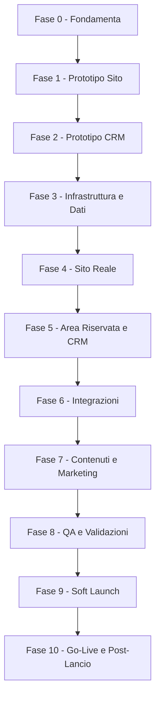

# Gestione Progetto - Fasi di Release e Step

> Piano di esecuzione a fasi con punti di approvazione (gate). Complementare al @13_Stima_Costi (che definisce l'ORDINE TECNICO di sviluppo): qui si governa il COME e QUANDO si rilascia, con prototipi e validazioni prima del go-live.
> Stato: In revisione · Ultimo aggiornamento: 2026-06-22
> Riferimenti: @13 (roadmap dev), @11 (sicurezza), @12 (operations), @10 (legale), DECISIONI.
> Diario di sviluppo (cronologia, dettagli e step operativi): vedi sezione "Diario di sviluppo" in fondo a questo documento.

## Principio dei "gate" (go / no-go)
Ogni fase ha un obiettivo, dei deliverable e un **criterio di uscita** che deve essere approvato prima di passare alla fase successiva. Questo evita di costruire sul vuoto e di scoprire problemi tardi.

## Legenda stati fase
- Da iniziare | In corso | In attesa di approvazione | Approvata

## Ruoli
- Lorenzo: fornisce informazioni, approva ai gate (contenuti, design, UX, legale, prezzi).
- Sviluppo (tu + AI): costruisce, testa, documenta.

## Flusso delle fasi

---

## Fase 0 - Fondamenta e raccolta info
- Obiettivo: avere tutti i prerequisiti prima di costruire.
- Deliverable: risposte di DOMANDE_PER_LORENZO; conferma abilitazione Entratel; incarico legale (privacy/T&C/DPIA, @10); asset brand (logo/foto) e shooting (@02/@09).
- Gate di uscita: prerequisiti legali e informativi raccolti; brand approvato.
- Stato: In corso

## Fase 1 - Prototipo Sito (validazione UX/design/copy)
- Obiettivo: validare esperienza, design e testi del sito pubblico PRIMA dello sviluppo completo.
- Deliverable: prototipo multipagina navigabile (home, tariffe, chi sono, form, FAQ) con contenuti reali ma senza backend.
- Tecnologia prototipo: DECISO -> mockup in Next.js + dati finti (evolve nel prodotto reale, no lavoro buttato).
- Gate di uscita: Lorenzo approva layout, flusso e copy.
- Stato: In corso - prototipo costruito e su GitHub; deploy Vercel da finalizzare (vedi Diario 2026-06-21). In attesa validazione Lorenzo.

## Fase 2 - Prototipo CRM (validazione flusso/usabilita)
- Obiettivo: validare interfaccia e flusso del CRM con dati finti.
- Deliverable: mockup di Kanban, scheda lavoro, anagrafica/storico, dashboard KPI (dati simulati).
- Gate di uscita: Lorenzo approva l'usabilita e conferma colonne/azioni/viste.
- Stato: In corso - prototipo costruito (Home operativa, Pipeline Kanban/Lista, Scheda pratica, Contatti, Statistiche) e su GitHub (vedi Diario 2026-06-22). In attesa validazione Lorenzo.

## Fase 3 - Infrastruttura e Dati
- Obiettivo: basi tecniche pronte (@13 step 1-3).
- Deliverable: ambienti dev/staging/prod, Supabase UE, schema + RLS + test cross-tenant, auth admin (2FA) e client passwordless.
- Gate di uscita: RLS testata (nessuna fuga cross-tenant, @11); CI/CD attiva.
- Stato: Da iniziare

## Fase 4 - Sito Reale
- Obiettivo: sito pubblico in produzione tecnica (non ancora pubblicizzato).
- Deliverable: pagine reali (da prototipo), form multi-step -> lead in DB + eventi GA4, checkout Stripe + webhook, pagine legali + CMP.
- Gate di uscita: flusso lead->pagamento funzionante in test; consensi e Consent Mode attivi (@08/@10).
- Stato: Da iniziare

## Fase 5 - Area Riservata e CRM
- Obiettivo: parte operativa funzionante.
- Deliverable: area cliente (upload/dashboard/download signed URL), CRM (Kanban, scheda lavoro, contacts/storico, validazione documenti, automazioni email, dashboard KPI base).
- Gate di uscita: ciclo completo pratica end-to-end in staging.
- Stato: Da iniziare

## Fase 6 - Integrazioni
- Obiettivo: automazioni complete.
- Deliverable: WhatsApp (se in v1), offline conversions, job/cron con retry, Looker Studio embeddato, Sentry.
- Gate di uscita: automazioni con retry verificate; alert attivi (@12).
- Stato: Da iniziare

## Fase 7 - Contenuti e Marketing
- Obiettivo: il "negozio" e pronto a ricevere traffico.
- Deliverable: 5 pillar article (accurati su autoliquidazione), schema.org, Google Business Profile, 20 recensioni iniziali, campagne Ads configurate (non ancora attive).
- Gate di uscita: contenuti pubblicati; tracciamento conversioni validato (@08).
- Stato: Da iniziare

## Fase 8 - QA e Validazioni
- Obiettivo: qualita e conformita prima del pubblico.
- Deliverable: checklist QA (@13), security review (@11), UAT con Lorenzo su dati reali, validazione legale finale, restore di prova del DB.
- Gate di uscita: checklist QA superata; legale approvato; backup/restore ok.
- Stato: Da iniziare

## Fase 9 - Soft Launch
- Obiettivo: validare in condizioni reali su scala ridotta.
- Deliverable: sito live con traffico limitato (budget Ads ridotto / cerchia ristretta); monitoraggio attivo.
- Gate di uscita: nessun bug bloccante; primi lead/pratiche gestiti correttamente.
- Stato: Da iniziare

## Fase 10 - Go-Live e Post-Lancio
- Obiettivo: lancio ufficiale e miglioramento continuo.
- Deliverable: scaling Ads sui dati (@09), manutenzione (@12), avvio funzioni fase 2 (OCR, export gestionale, ROI avanzato).
- Gate di uscita: -
- Stato: Da iniziare

---

## Decisione (congelata): tecnologia del prototipo (Fasi 1-2)
- DECISO: mockup statico in Next.js + dati finti, che evolve nel prodotto reale (no lavoro buttato).
- Scartate: Figma/clickable (solo visivo) e HTML statico separato (da rifare nello stack reale).

## Note
- Le fasi possono parzialmente sovrapporsi (es. contenuti SEO mentre si sviluppa il CRM), ma i gate restano vincolanti.
- Aggiornare lo "Stato" di ciascuna fase man mano che si avanza.

---

# Diario di sviluppo

> Cronologia di cosa e stato fatto, con dettagli tecnici, decisioni operative e step ancora da fare. Si aggiorna a ogni avanzamento. Il diario serve a Lorenzo e allo sviluppo per non perdere il filo.

## Coordinate tecniche del progetto
- **Repository GitHub**: `https://github.com/maurotoncelli/successioni-armellin` (branch `main`).
- **App**: Next.js 16 (App Router, Turbopack) + TypeScript + Tailwind CSS v4. La web app vive nella sottocartella **`web/`** del repo; alla radice restano `blueprint/`, `seed/`, ecc.
- **Hosting**: Vercel (collegato a GitHub, deploy automatico a ogni push). **Root Directory del progetto Vercel = `web`**.
- **Struttura cartelle principali** (dentro `web/src`):
  - `app/(site)/` -> sito pubblico (route group con navbar/footer; gli URL NON cambiano).
  - `app/crm/` -> CRM interno (layout dark dedicato, area `/crm`).
  - `components/site/` e `components/crm/` -> componenti dei due ambiti.
  - `content/` -> dati finti del prototipo (`site.ts`, `crm-data.ts`); `seed/content_entries.it.json` alla radice del repo per i testi.
- **Stato dati**: tutto il prototipo (sito + CRM) gira su **dati FINTI**. Nessun backend ancora collegato. Il "motore" reale (Supabase + schema + RLS) e la Fase 3 e abilitera sia i pacchetti dinamici del sito sia il CRM reale.

## Cronologia

### 2026-06-21 - Fase 1: Prototipo Sito
- Scaffold Next.js nella cartella `web/` con stack del blueprint (Next.js + TS + Tailwind v4 + design token brand: navy/oro, font Lora/Inter/Playfair).
- Costruite tutte le pagine pubbliche da `STRUTTURA_CONTENUTI_SITO.md`: Home, Tariffe, Chi Sono, Come Funziona, Documenti, FAQ, Contatti, Guide, Recesso, pagine legali (placeholder), funnel `/preventivo` (+ `/grazie`) e `/checkout` (mock), pagina 404.
- Contenuti caricati da `seed/content_entries.it.json` + fixtures locali (`content/site.ts`) per pacchetti, add-on, FAQ, recensioni, guide.
- Repo Git inizializzato e pushato su GitHub; collegamento a Vercel.
- **Problema aperto (deploy)**: Vercel restituisce 404. Causa diagnosticata: il "Framework Preset" del progetto Vercel e rimasto su "Other" (impostato all'import quando la root era vuota). **Fix da completare lato Lorenzo/Mauro**: in Vercel -> Project Settings -> impostare **Framework Preset = Next.js** (oltre a Root Directory = `web`), salvare e rilanciare il deploy. Ogni nuovo push ritenta il deploy.

### 2026-06-22 - Fase 2: Prototipo CRM "Flowdesk - Armellin"
- **Riorganizzazione layout**: introdotto il route group `app/(site)/` per il sito pubblico (navbar/footer/CTA mobile) separato dal CRM; `app/layout.tsx` reso minimale (solo html/body/font). Gli URL pubblici restano identici.
- **Tema CRM dark** (`.theme-crm` + token "Flowdesk - Armellin" in `globals.css`, da @SPEC_Design_Tokens): superfici scure, accento indigo->viola, distinto dal tema navy/oro del sito.
- **Layout CRM**: sidebar (Home/Pratiche/Contatti/Statistiche + voce CMS marcata "Fase 5") e topbar con barra di **ricerca globale** (placeholder: codice pratica, CF defunto, nome/email).
- **Dati finti CRM** (`content/crm-data.ts`): 8 pratiche d'esempio lungo tutta la pipeline, con contatti, checklist documenti, comunicazioni, To-Do, log eventi, alert e KPI derivati. Enum allineati a @SPEC_Data_Model.
- **Pagine costruite**:
  - **Home operativa** (`/crm`): card di sintesi (schede attive, da fare, completate, incassi), pannello **alert automatici**, widget **To-Do**, tabella "Tocca a te".
  - **Pipeline** (`/crm/pratiche`): toggle **Kanban / Lista**; card con badge azione `action_owner` ("Tocca a te" / "In attesa del cliente" / "In attesa AdE"), urgenza, importo.
  - **Scheda pratica** (`/crm/pratiche/[id]`): riepilogo dati, riepilogo ordine (line items + totale + nota imposte), **checklist documenti** con Approva/Rifiuta, cronologia comunicazioni (auto/manuale), appunti (chiamata/pagamenti/note), date chiave, To-Do, timeline eventi.
  - **Contatti** (`/crm/contatti`): rubrica con consenso marketing e **storico pratiche** per contatto.
  - **Statistiche** (`/crm/statistiche`): KPI (pratiche, onorari, ticket medio, conversione) + grafici a barre per stato/pacchetto.
  - **Calendario** (`/crm/calendario`, aggiunto 22/06 su richiesta): viste **Mese** e **Agenda** con le date chiave derivate dalle pratiche (apertura, consegna prevista, scadenza 12 mesi = decesso + 1 anno, invio AdE), legenda colori, click sull'evento -> apre la scheda. **Senza sync Google** (rimandata: e "idea futura" anche nel cap. 05).

### 2026-06-22 - Prototipo Area Riservata cliente (Fase 5 anticipata, su richiesta)
- Costruito il prototipo navigabile dell'**Area Riservata** (`/area-riservata`) con dati finti, in tema brand (navy/oro) e **mobile-first**, separato dal sito marketing (header + sidebar desktop + bottom-bar mobile dedicati). Allineato al cap. 06.
- **Data-driven**: tutte le schermate derivano dalla stessa pratica del CRM (`area-data.ts` deriva da `crm-data.ts`); la **checklist documenti e l'unica fonte condivisa** CRM<->cliente (mappata nei 3 stati cliente: Da caricare / Caricato / Da rifare; "Approvato" resta interno).
- **Schermate**: Accesso passwordless (mock magic link + "Entra nella demo"), Dashboard (tracker stato client-friendly + "prossima azione" contestuale + avanzamento documenti + card imposte), Il tuo acquisto (`/ordine`: line items, totale, cosa include, stato pagamento, fattura, riquadro imposte), Documenti (checklist interattiva con contatore "X di Y", upload simulato, pulsante-cancello sticky "Ho finito - invia a Lorenzo" che si attiva solo a checklist completa, stato "Da rifare" con motivo), Dati/IBAN, Mandato (lettura + accettazione FES con conferma), Recesso self-service (finestra 14gg + conseguenze + invio richiesta), Conclusa (download finali, attivi solo a pratica conclusa), Profilo (recapiti + preferenze notifiche).
- Aggiunto link "Area riservata" nel footer del sito pubblico.
- **QA**: build OK (route /area-riservata/* prerenderizzate), ESLint OK, smoke test runtime (tutte 200).
- **Limiti noti**: login, upload, firma, download e persistenza sono simulati lato client; diventano reali con auth Supabase + storage + signed URL (Fase 3-5).
- **QA**: build di produzione OK (31 route, CRM incluse), ESLint OK, smoke test runtime (tutte le route 200). Commit e push su GitHub.
- **Limiti noti del prototipo CRM** (storico, ora superati): all'inizio i pulsanti Cambia stato, Approva/Rifiuta, Nuova pratica e la ricerca erano UI non funzionanti. **Aggiornamento 22/06**: Cambia stato/Approva-Rifiuta (workflow + Kanban), **ricerca globale**, **Nuova pratica** e **Brogliaccio PDF** sono ora operativi e collegati al DB. Nessuna UI del CRM resta dimostrativa.

### 2026-06-22 - Riunione 2: risposte di Lorenzo recepite (bibbia + prototipo)
- Aggiornati `DOMANDE_PER_LORENZO.md` (risposte) e `DECISIONI.md` (vincoli congelati), piu cap. 01 (pricing) e 02 (brand).
- **Anagrafica/fiscale**: ditta individuale; P.IVA/CF e Albo confermati; indirizzo Pontedera; orario 9-13 / 15-19; **regime forfettario (NO IVA)**; fatturazione Aruba; **CNS Aruba**; **no mediazione immobiliare**; diplomato; in proprio dal 2012; **~100 successioni**; abilitato Entratel.
- **Pricing/capienza**: Completo 490 (fino a 5 eredi, 1-3 immobili, fino a 5 conti); Zero Stress (3-8 immobili, max 5 conti, 5 eredi, recupero documenti incluso) - prezzo 790 da confermare; Semplice 290 invariato. **Add-on**: Riunione di usufrutto 150 (spostata nei servizi correlati) + **Adeguamento/ricalcolo IMU 90 (prezzo PROPOSTO da noi, da confermare)** + voltura aggiuntiva 60.
- **Su misura**: scatta per tanti immobili / particelle agricole / terreni; NON per annessi, testamento, eredi all'estero; recupero documenti solo se eccede il pacchetto 490. Conguaglio e SLA confermati (lavorazione ~3-4 gg con doc completi).
- **Business**: obiettivo fatturato min 10k / ideale 15k al mese; crescita con budget ADV; soft launch obiettivo ~15 successioni.
- **Esonero successione** (foto fornita): NON dovuta solo se TUTTE e tre: eredi in linea retta/coniuge + attivo lordo <= 100.000 EUR + nessun immobile (art. 28 c.7 TUS). Recepito nel form/Esito A (onesta).
- **Firma mandato**: oggi cartaceo, disposto ad aggiornarsi -> v1 baseline cartaceo (scarica/firma/ricarica) + FES consigliata.
- **Accesso area riservata**: Magic Link email + OTP email, **+ opzione OTP via telefono/SMS** se il cliente preferisce.
- **Brand**: logo provvisorio = "A" dorato (definitivo poi); valori = onesto/pratico/realista/reperibile/dedicato/lavoratore (copy in @02); Google Business SI; 20 recensioni SI; foto/video forniti da Lorenzo; dominio DA REGISTRARE; partner citato = commercialista dedicato.
- **Prototipo aggiornato**: `site.ts` (add-on usufrutto 150 + IMU 90, capienza pacchetti), login area riservata con scelta Email/Telefono, schermata mandato con alternativa cartacea.

### 2026-06-22 - Fase 3 avviata: motore reale (prima fetta, CMS pacchetti)
- Obiettivo: passare dai dati finti al database reale, partendo da pacchetti/add-on/FAQ (fetta a basso rischio, niente dati personali).
- Stack DB: **Supabase cloud free in UE** (scelto al posto del locale perche Docker non e installato; lo schema/codice e identico).
- Fatto (codice, attivo appena si collegano le chiavi):
  - `supabase init` + migrazioni versionate: `supabase/migrations/20260622120000_cms_content.sql` (enum package_type, tabelle packages/addons/faqs, trigger updated_at, RLS: lettura pubblica solo record attivi/pubblicati, scrittura solo service_role) e `..._cms_seed.sql` (contenuti confermati Riunione 2, idempotente).
  - Client Supabase server/admin (`web/src/lib/supabase/`), tipi DB scritti a mano (rigenerabili con `supabase gen types`).
  - Layer `web/src/lib/cms.ts`: `getPackages/getAddons/getFaqs` con **fallback automatico alle fixture** se il DB non e configurato (il sito non si rompe mai).
  - Refactor del sito: tariffe, faq, checkout, ordine e le card pacchetti ora leggono dal layer CMS.
  - Mini-CMS nel CRM: `/crm/listino` (voce in sidebar) per modificare prezzi/testi/disponibilita di pacchetti e add-on, con server action "Salva e pubblica" che rigenera le pagine (revalidatePath).
  - Gate admin **provvisorio** su `/crm` (`web/src/proxy.ts` + `/crm-login`): cookie con hash della password (`ADMIN_PASSWORD`); se la password non e impostata il gate e disattivato (demo libera). Sara sostituito da Supabase Auth.
- QA: build OK, lint OK. **DB collegato e testato dal vivo** (22/06): chiavi in `web/.env.local`, migrazioni applicate via pooler IPv4 (`aws-1-eu-central-1`). Smoke test scrittura superato: prezzo "Completo" 490->495 dal motore CMS, riflesso su `/tariffe`, poi ripristinato a 490.
- Da rifare prima del go-live: **rigenerare le chiavi Supabase** (anon/service/DB password) perche condivise in chat, e impostare `ADMIN_PASSWORD`.

### 2026-06-22 - Fase 3, seconda fetta: motore PRATICHE reale (lead dal sito -> CRM)
- Obiettivo: far girare il cuore del CRM. I lead non sono piu finti: il form del sito crea record reali (contatto + pratica) nel database, visibili subito nel CRM.
- Schema: `supabase/migrations/20260622130000_crm_practices.sql` - enum `practice_status`/`action_owner`/`payment_status`, tabelle `contacts` e `practices`. Le collezioni ricche (checklist, comunicazioni, task, log, righe ordine) sono in colonne **jsonb** (pragmatico ora, normalizzabile poi). Codice pratica leggibile via sequence `practice_code_seq` (default `SUC-AAAA-NNNN`). RLS attiva senza policy pubbliche: questi dati sono **privati**, accessibili solo a `service_role` (il CRM); anon non legge nulla.
- Seed: `..._crm_seed.sql` ripropone gli 8 contatti + 8 pratiche del prototipo (uuid stabili, codici 0005-0012), cosi Lorenzo vede il CRM gia popolato. La sequence parte da 0013 per i lead nuovi.
- Data layer `web/src/lib/crm.ts`: `getPractices/getPractice/getContacts` (via client admin, con fallback fixture) + derivazioni **calcolate dalle pratiche** (`deriveKpi`, `deriveAlerts`, `calendarEvents`, `statusCounts`) = unica fonte di verita.
- Refactor CRM: home, pratiche (kanban/lista), scheda pratica `[id]`, contatti (con storico), calendario e statistiche ora leggono dal DB; pagine `force-dynamic` per dati sempre freschi.
- Lead reale: `web/src/app/(site)/preventivo/actions.ts` (`createLead`) inserisce contatto + pratica LEAD con logica preventivo (pacchetto suggerito + flag su misura allineati a @04) e `revalidatePath` del CRM; il form multi-step `preventivo-form.tsx` ora raccoglie nome/email/telefono/consenso e chiama l'azione (no piu mock).
- QA: build OK (route CRM tutte dinamiche), lint OK. **Smoke test end-to-end dal vivo**: lead di prova creato -> codice auto `SUC-2026-0013` dalla sequence -> comparso in `/crm/pratiche` (conferma lettura dal DB) -> poi eliminato (DB ripristinato a 8 contatti / 8 pratiche).
- Resta finto/da fare nelle fasi successive: pagamenti Stripe, autenticazione reale (admin + cliente), upload/validazione documenti, automazioni email/WhatsApp.

### 2026-06-22 - Fase 4, prima fetta: pagamenti Stripe (checkout reale + webhook)
- Obiettivo: trasformare il `/checkout` da mock a pagamento reale e confermare l'incasso in automatico nel CRM. Sblocca il flusso commerciale.
- Scelta: **Stripe Checkout hosted** (pagina di pagamento di Stripe) invece del Payment Element. Motivi: PCI-light (non gestiamo dati carta), supporto nativo a carta + **rate/BNPL** (Klarna/PayPal Pay in 3/Scalapay attivabili da Dashboard) coerente con @04, minor superficie di codice. Valuta EUR; le imposte di Stato NON passano da Stripe (solo onorario).
- Schema: `supabase/migrations/20260622140000_stripe_payments.sql` - aggiunge a `practices` i campi `stripe_session_id`, `stripe_payment_intent_id`, `paid_at`, `payment_recorded_by`; aggiunge lo stato `PARTIALLY_REFUNDED` a `payment_status`; crea `stripe_events` (registro di **idempotenza** dei webhook, RLS senza policy = solo service_role).
- Codice (attivo appena si impostano le chiavi Stripe):
  - `web/src/lib/stripe.ts` (client server-only + `isStripeConfigured`), `web/src/lib/order.ts` (funzione PURA che compone `line_items` + totale: pacchetto + sovrapprezzo immobili oltre il 3 + add-on), `web/src/lib/payments.ts` (`createCheckoutSession` condivisa: snapshot prezzo/righe sulla pratica -> `PENDING`, crea la sessione Stripe, salva `stripe_session_id`).
  - `POST /api/checkout` (checkout pubblico) e server action `generatePaymentLink` del CRM riusano la **stessa** logica (un solo prezzo di verita).
  - `POST /api/stripe/webhook`: **verifica firma** + idempotenza (`stripe_events`); su `checkout.session.completed` porta la pratica a `PAGATO`/`PAID` (`payment_recorded_by=SYSTEM`, `paid_at`, `action_owner=CLIENT`, log + comunicazione AUTO); su `charge.refunded` -> `REFUNDED`/`PARTIALLY_REFUNDED`. La conferma del pagamento e SEMPRE qui, mai sul redirect del browser.
  - UX sito: `/checkout?practice=<id>` ora mostra il riepilogo reale della pratica e un bottone "Paga" funzionante (consensi T&C + avvio) -> redirect a Stripe -> `/checkout/conferma` (verifica stato sessione). Il form preventivo passa il `practiceId` alla thank-you (Esito B -> checkout della pratica).
  - UX CRM: scheda pratica -> card Pagamento -> **"Genera link di pagamento"** (flusso assistito @05): crea la sessione e mostra il link da inviare al cliente (copia/apri).
- Fallback: senza chiavi Stripe i flussi mostrano un avviso ("pagamenti non ancora attivi") invece di rompersi, come per Supabase.
- QA: build di produzione OK (nuove route `/api/checkout`, `/api/stripe/webhook`, `/checkout`, `/checkout/conferma`), ESLint OK.
- **Migrazione APPLICATA dal vivo (22/06)**: la `20260622140000_stripe_payments.sql` e stata eseguita sul DB Supabase (pooler transaction, porta 6543) e verificata: colonne `stripe_*`/`paid_at`/`payment_recorded_by` presenti, tabella `stripe_events` creata, enum `payment_status` con `PARTIALLY_REFUNDED`. NB: la password del DB e stata resettata da Lorenzo (le chiavi anon/service_role dell'app NON cambiano, quindi sito/CRM non sono impattati).
- Resta solo da attivare Stripe (Lorenzo deve ancora creare l'account):
  1. [FATTO] Migrazione applicata.
  2. Impostare in `web/.env.local` / Vercel: `STRIPE_SECRET_KEY`, `STRIPE_WEBHOOK_SECRET`, `NEXT_PUBLIC_STRIPE_PUBLISHABLE_KEY` (chiavi **test** per ora).
  3. Endpoint webhook: in locale `stripe listen --forward-to localhost:3000/api/stripe/webhook`; in prod creare il webhook su Dashboard verso `https://<dominio>/api/stripe/webhook` (evento `checkout.session.completed`, opz. `charge.refunded`).
  4. Smoke test end-to-end con carta di test `4242 4242 4242 4242` -> pratica a PAGATO nel CRM.
- Resta da fare nelle fasi successive: auth reale (admin 2FA + cliente), fattura/ricevuta automatica, conguagli cambio pacchetto (UPGRADE/DOWNGRADE) e refund self-service dal pannello recesso, eventi GA4 `begin_checkout`/`purchase`.

### 2026-06-22 - Fase 5: Autenticazione CLIENTE reale + Area Riservata su dati veri
- **Obiettivo**: trasformare l'area riservata da prototipo (dati finti, "cliente = Lucia Ferri") ad area **reale**, con login passwordless e isolamento per cliente via RLS. Il gate admin del CRM e stato **lasciato intatto** (ADMIN_PASSWORD) per evitare lockout: l'auth admin con 2FA e la fetta successiva.
- **DB** (migrazione `20260622150000_auth_profiles.sql`, APPLICATA dal vivo e verificata): enum `role` (ADMIN/CLIENT); tabella `profiles` (`auth.users` -> `contact_id` + `role`); helper `public.current_contact_id()` (SECURITY DEFINER, evita ricorsione RLS); policy **per-cliente** additive: `profiles_select_own`, `client_select_own_contact`, `client_select_own_practices`. Anon resta negato; il CRM (service_role) non e impattato.
- **Sessione (cookie) con `@supabase/ssr`**: `lib/supabase/ssr.ts` (client server legato ai cookie, letture in RLS) + `lib/supabase/middleware.ts` (refresh token); integrati nel **proxy** (Next 16, runtime Node): `/area-riservata/*` rinnova la sessione, `/crm/*` mantiene il gate provvisorio.
- **Login** (`/area-riservata`): rifatto reale - Magic Link via email (primario) + OTP a 6 cifre (alternativa); server actions `sendMagicLink`/`verifyOtp`/`signOut`; callback `/area-riservata/auth/callback` che scambia il code per la sessione. Rimossa la scorciatoia "Entra nella demo".
- **Provisioning profilo** (`lib/area.ts`): al primo accesso crea il `profiles` e lo collega all'anagrafica **per email** (via service_role); ruolo ADMIN se l'email e in `ADMIN_EMAILS`. `getClientView()` (cache per richiesta) legge la pratica del cliente **in RLS** e la mappa nella stessa shape del CRM.
- **Area cablata ai dati reali**: layout con **gating** (redirect a login se non autenticato) + logout reale; header con nome/codice pratica veri; Dashboard, Il tuo acquisto, Documenti, Conclusa leggono la pratica reale (server); Mandato/Profilo leggono l'account dal context (`AreaDataProvider`). Stato vuoto "nessuna pratica collegata" gestito. Le **scritture** (upload, firma mandato, IBAN, recesso) restano simulate: diventano reali con la fetta Storage/tabelle documenti.
- **QA**: ESLint OK, build OK (rotte area ora dinamiche), smoke test gating OK (`/area-riservata/dashboard` -> 307 al login; login 200; `/crm` e home intatti). Script temporaneo di migrazione e `pg` rimossi dopo l'uso.
- **Per il test live (lato Lorenzo/Mauro)**: 1) in `web/.env.local`/Vercel impostare `NEXT_PUBLIC_SITE_URL` e `ADMIN_EMAILS`; 2) su Supabase Dashboard > Authentication > URL Configuration aggiungere i Redirect URLs (`http://localhost:3000/**` + dominio); 3) per testare i dati, accedere con un'email gia presente come `contacts.email` (oppure aggiornare un contatto seed con la propria email); 4) per l'OTP a 6 cifre, aggiungere `{{ .Token }}` al template email.
- **Resta per la fetta successiva**: auth **ADMIN** reale (Supabase Auth + 2FA TOTP) che sostituisce `ADMIN_PASSWORD`; poi Storage + tabelle documenti per rendere reali gli upload/firma/IBAN.

### 2026-06-22 - Fase 5: Autenticazione ADMIN reale + 2FA (TOTP) sul CRM
- **Obiettivo**: sostituire il gate provvisorio del CRM (cookie + `ADMIN_PASSWORD`) con autenticazione vera **email+password (1o fattore) + TOTP obbligatorio (2o fattore)**, senza rischiare lockout (oggi `/crm` e aperto perche `ADMIN_PASSWORD` e vuota).
- **Scelte (confermate)**: 1o fattore email+password; `ADMIN_PASSWORD` mantenuto come **accesso d'emergenza** durante la transizione; TOTP **obbligatorio** (attivazione forzata al primo accesso, poi sempre richiesto).
- **Identita/ruolo**: riuso di `profiles` + enum `role`; nuovo modulo condiviso `lib/profiles.ts` (`ensureProfile` con provisioning, collegamento a `contacts` per email e **upgrade a ADMIN** se l'email e in `ADMIN_EMAILS`). `lib/area.ts` rifattorizzato per usarlo.
- **Gate** (`lib/admin.ts` `requireAdmin`, nel layout `/crm`): ordine -> (1) cookie d'emergenza `ADMIN_PASSWORD`; (2) se nessun enforcement configurato (niente `ADMIN_PASSWORD` ne `ADMIN_EMAILS`) il CRM resta **aperto** come prima (no lockout); (3) altrimenti **sessione Supabase + ruolo ADMIN + AAL2** (2FA verificato), senno redirect a `/crm-login`. Il **proxy** ora si limita a rinnovare la sessione per `/crm` e `/area-riservata` (gating nei layout).
- **Login** (`/crm-login`, ridisegnato): email+password -> se il fattore TOTP esiste chiede il codice; se non esiste **forza l'attivazione** (QR + segreto da scansionare con Google/Microsoft Authenticator) -> verifica -> AAL2 -> `/crm`. **Bootstrap** del primo admin (solo email in `ADMIN_EMAILS`): crea l'utente Supabase via service_role e avvia subito l'attivazione 2FA. **Accesso d'emergenza** con `ADMIN_PASSWORD` disponibile in un pannello a parte. Logout: signOut Supabase + pulizia cookie d'emergenza.
- **QA**: ESLint OK, build OK. Smoke test: modalita transizione (`ADMIN_EMAILS` vuota) -> `/crm` 200 (aperto); enforcement (`ADMIN_EMAILS` set) -> `/crm` e `/crm/pratiche` 307 a `/crm-login`; area cliente sempre protetta. Nessuna migrazione DB necessaria (profiles/role gia presenti).
- **Per attivare (lato Lorenzo/Mauro)**: 1) in `.env.local`/Vercel impostare `ADMIN_EMAILS` (e tenere `ADMIN_PASSWORD` come emergenza finche serve); 2) su `/crm-login` -> "Primo accesso admin" per creare l'account e attivare il TOTP; 3) verificato l'accesso reale, **svuotare `ADMIN_PASSWORD`**.

### 2026-06-22 - Fase 5: Documenti reali (upload cliente + validazione CRM)
- **Obiettivo**: rendere reale il caricamento documenti dell'area cliente (prima simulato con `setTimeout`) e dare a Lorenzo gli strumenti per **scaricare e validare** i file dal CRM.
- **Storage**: bucket Supabase **privato** `practice-docs` (creato lazy al primo upload con `fileSizeLimit` 10MB e MIME ammessi PDF/JPG/PNG). **Modello di sicurezza scelto**: nessuna policy RLS path-based sullo Storage; **tutto l'accesso passa solo dal server con service_role** e la PROPRIETA e verificata nel codice (cliente via `getClientView` -> solo la propria pratica; CRM via `requireAdmin`). Bucket privato = anon/authenticated negati di default.
- **Stato documenti nel jsonb `checklist`**: niente tabelle nuove in questa fase (coerente con l'approccio pragmatico @SPEC_Data_Model). Estesi i campi opzionali della voce checklist: `filePath`, `fileName`, `uploadedAt`. La chiave di azione e l'**indice** della voce nella checklist.
- **Libreria condivisa** `lib/documents.ts`: `uploadDocument` (valida tipo/peso, ensureBucket, upsert su `practiceId/index-nome`, voce -> CARICATO), `removeDocument` (rimuove file -> voce ATTESO), `signedDocUrl` (URL firmato 60s), `setDocStatus` (APPROVATO/RIFIUTATO+motivo).
- **Lato cliente** (`/area-riservata/documenti`): upload reale via route handler `POST /api/area/documents/upload` (multipart, niente limite 1MB delle server action) e `POST /api/area/documents/delete`; UI con input file vero, validazione client (peso/formato), nome file mostrato, errori inline. "Ho finito -> invia a Lorenzo" = server action `submitDocuments` (action_owner -> ADMIN, log `DOCUMENTS_SUBMITTED` + comunicazione AUTO).
- **Lato CRM** (scheda pratica): la checklist e ora interattiva (`components/crm/checklist.tsx`) con **download firmato** + **Approva/Rifiuta** (server action con motivo, difese `requireAdmin` anche nelle action). Il cliente rivede subito "Da rifare" + motivo (RLS).
- **QA**: ESLint OK, build OK (nuove route `/api/area/documents/upload` e `/delete`). Nessuna migrazione SQL necessaria (bucket creato a runtime; checklist e gia jsonb).
- **Resta da fare**: rendere reali anche **firma mandato** e **IBAN/recesso** (oggi ancora simulati); scansione antivirus dei file caricati; eventuale passaggio a tabelle `document_requirements`/`documents` se servira granularita (versioni, audit per-file).

### 2026-06-22 - Fase 5: Workflow pratica operativo dal CRM
- **Obiettivo**: rendere reali le azioni di gestione della pratica dal CRM (prima solo lettura): cambio stato, registrazione contatti, note rapide.
- **Cambio stato** (header scheda pratica): dropdown con tutti gli stati (`pipelineOrder` + ANNULLATA) -> server action `changeStatus` che aggiorna `status`, deriva `action_owner` (mappa per stato: LEAD->ADMIN, PREVENTIVO/PAGATO/ATTESA_DOC->CLIENT, LAVORAZIONE->ADMIN, INVIATA->EXTERNAL, CHIUSA/ANNULLATA->NONE), imposta `opened_at` al primo ingresso in lavorazione e `submitted_at` su INVIATA, e registra un evento di log. Revalida scheda + lista + dashboard.
- **Comunicazioni manuali**: form nella card "Cronologia comunicazioni" -> `addCommunication` (canale EMAIL/WhatsApp/Telefono/Di persona + direzione + oggetto, `source=MANUAL`) appende al jsonb `communications` + log.
- **Note rapide**: `addNote` appende al campo `notes` una riga datata `[YYYY-MM-DD HH:mm] testo` + log (visualizzazione con `whitespace-pre-line`).
- **Sicurezza**: tutte le action passano da service_role con difesa `requireAdmin` (oltre al gate del layout `/crm`). Tipizzazione update via `Partial<PracticeRow>`.
- **QA**: ESLint OK, build OK. Nessuna migrazione SQL (si usano colonne/jsonb gia presenti).
- **Resta da fare**: spostamento card via drag&drop nel Kanban (oggi il cambio stato e dalla scheda), automazioni email sui cambi stato, e i restanti flussi cliente (mandato/IBAN reali).

### 2026-06-22 - Fase 5: Mandato e IBAN reali (area cliente + CRM)
- **Obiettivo**: rendere reali gli ultimi due flussi cliente simulati: firma del mandato e raccolta IBAN per le imposte.
- **Vincolo affrontato**: la migrazione SQL per aggiungere colonne dedicate **non e applicabile ora** (password del DB resettata da Lorenzo, non piu disponibile lato sviluppo). Scelta **NO-DDL**: gli "extra" della pratica vivono in un documento JSON privato nello Storage gia esistente `practice-docs` -> `<practiceId>/_extras.json`. Funziona da subito senza toccare lo schema.
- **IBAN cifrato** (`lib/crypto-iban.ts`): AES-256-GCM con chiave derivata via scrypt dalla `SUPABASE_SERVICE_ROLE_KEY` (gia segreta, solo-server) -> nessuna nuova env. Nel JSON si salvano `enc` (blob cifrato), `last4`, `providedAt`. Al **cliente** si mostrano solo le ultime 4 cifre; al **CRM** Lorenzo puo rivelarlo on-demand (decifratura server-side) e copiarlo per l'F24. Cancellabile eliminando l'oggetto (coerente con @10/@11).
- **Mandato** (`lib/practice-extras.ts`): firma **elettronica** (server action `signMandate`, registra metodo/nome/data) oppure **cartacea** (download del fac-simile generato lato client + upload del firmato via route `POST /api/area/mandate/upload`, file nello Storage privato). Stato e file scaricabile mostrati nel CRM.
- **Sicurezza**: accesso 100% server-side con service_role; proprieta verificata (cliente via `getClientView`, CRM via `requireAdmin`). Le pagine `/area-riservata/mandato` e `/dati` sono ora server component che leggono lo stato reale e montano i form client.
- **QA**: ESLint OK, build OK (nuova route `/api/area/mandate/upload`). Nessuna migrazione applicata.
- **Resta da fare**: cancellazione automatica dell'IBAN dopo l'uso (retention @10), copia PDF firmata del mandato elettronico, e in prospettiva la normalizzazione su colonne/tabelle dedicate quando si riavra accesso DDL al DB.

### 2026-06-22 - Fase 5: Automazioni email (notifiche transazionali)
- **Obiettivo**: inviare email automatiche al cliente sugli eventi chiave della pratica (prima si registrava solo la comunicazione, senza invio reale).
- **Provider**: Resend via API REST (`lib/email.ts`, nessuna dipendenza npm aggiunta). **Fallback graceful** come Stripe/Supabase: senza `RESEND_API_KEY` gli invii vengono saltati (log) e l'app continua a funzionare. Wrapper HTML brandizzato con CTA verso l'area riservata.
- **Notifiche** (`lib/notifications.ts`): cambio stato pratica -> email dedicata per PAGATO ("carica i documenti"), ATTESA_DOC, LAVORAZIONE, INVIATA, CHIUSA; documento **rifiutato** -> email "un documento va ricaricato" con il motivo. Ogni invio riuscito registra anche una **comunicazione AUTO** in cronologia (canale EMAIL, OUTBOUND) + log `email_inviata`, cosi il CRM resta la fonte unica.
- **Wiring**: le email sono **automatiche come conseguenza della transizione** (@05 tabella automazioni), NON con pulsanti "avvisa cliente". Integrate in `changeStatus` (cambio stato dalla scheda o dal Kanban) e `rejectDocument`. Destinatario = `client_email`. Il pulsante "Registra comunicazione" resta solo per annotare contatti avvenuti fuori dal sistema (manuali).
- **Fix webhook (22/06, dopo nota utente)**: lo stato **Pagato** e auto via webhook Stripe e aggiornava la pratica SENZA passare da `changeStatus`, quindi non partiva l'email. Aggiunto l'invio di `notifyStatusChange(..., "PAGATO")` ("pagamento ricevuto + invito upload") nel webhook. La nota "documenti finali pronti" NON e un pulsante: e l'email automatica della transizione a CHIUSA ("pratica conclusa, documenti disponibili").
- **Config**: nuove env `RESEND_API_KEY` e `EMAIL_FROM` (richiede dominio verificato su Resend). Aggiunte a `.env.example` e `SPEC_Env_Vars`.
- **QA**: ESLint OK, build OK. Da testare dal vivo quando ci sara il dominio + account Resend.
- **SICUREZZA AUTOMAZIONI (@05 righe 129-134)**: (1) **modale di conferma** sulle transizioni a effetto esterno -> **FATTO il 22/06** (vedi entry dedicata sotto); (2) **invio ritardato con finestra di annullamento** (60-120s) e (3) **"annulla ultima azione"** -> **DA FARE** (richiedono job queue/cron, vedi entry dedicata).
- **Resta da fare**: [FATTO il 22/06 - email su imposte comunicate e recesso (vedi entry "gestione pratica")]. Restano: WhatsApp, Measurement Protocol per il purchase server-side.

### 2026-06-22 - Fase 5: Kanban operativo (drag&drop cambio stato)
- **Obiettivo**: spostare le pratiche tra le colonne del Kanban trascinandole, non solo dalla scheda.
- **Implementazione**: drag&drop nativo HTML5 (nessuna dipendenza) in `components/crm/practices-board.tsx`. Trascinando una card sull'altra colonna si chiama la server action `changeStatus` (stessa logica della scheda: deriva `action_owner`, timestamp, log, email automatica). UI **ottimistica** (la card si sposta subito) con **rollback** + messaggio se l'update fallisce, spinner sulla card in aggiornamento, colonna evidenziata durante il dragover.
- **Note**: il Kanban copre `pipelineOrder`; per "Persa/Annullata" si usa la scheda. La vista Lista resta in sola lettura.
- **QA**: ESLint OK, build OK.

### 2026-06-22 - Fase 5: Documenti finali (consegna) - upload CRM + download cliente
- **Obiettivo**: consegnare al cliente i documenti finali (ricevuta AdE, dichiarazione, visure, fattura) in modo reale, non piu mock.
- **Storage**: riusa il bucket privato `practice-docs` (path `<practiceId>/final/<ts>-<nome>`); l'elenco vive in `_extras.json` (`finalDocuments[]` con label/fileName/uploadedAt/filePath), stessa logica NO-DDL di mandato/IBAN.
- **CRM** (scheda pratica, `components/crm/final-docs-card.tsx`): upload con **etichetta** (route `POST /api/crm/final-docs/upload`, `requireAdmin`), lista con **download firmato** ed **elimina** (server action). 
- **Area cliente** ("Conclusa"): se ci sono documenti reali li mostra con **download firmato** (server action `getFinalDocUrl` con ownership via `getClientView`); altrimenti resta l'anteprima "cosa riceverai" (fac-simile) disabilitata. Rimosso il bottone "Scarica tutto (ZIP)" (non implementato).
- **Sicurezza**: accesso allo Storage solo server-side con service_role; URL firmati a tempo; proprieta verificata (cliente via sessione, CRM via requireAdmin).
- **QA**: ESLint OK, build OK (nuova route `/api/crm/final-docs/upload`).
- **Resta da fare**: [FATTO il 22/06 - notifica email "documenti pronti" + generazione fattura (Opzione L)]. Resta: "scarica tutto" (zip).

### 2026-06-22 - Fase 4: Analytics GA4 + Consent Mode + banner cookie
- **Obiettivo**: tracciare gli eventi marketing chiave nel rispetto del GDPR (consenso esplicito).
- **GA4 + Consent Mode v2** (`components/analytics/google-analytics.tsx`): default **tutto negato** (ad/analytics storage), si attiva solo dopo consenso. Render solo se `NEXT_PUBLIC_GA4_MEASUREMENT_ID` e impostato (altrimenti no-op totale). Il consenso salvato in localStorage viene riletto alle visite successive.
- **Banner consensi (CMP minimale)** (`components/analytics/consent-banner.tsx`): "Accetta tutti" / "Solo necessari", link alla cookie policy; aggiorna il Consent Mode e memorizza la scelta. Montato nel layout pubblico `(site)`.
- **Eventi** (`lib/analytics.ts` `trackEvent`, no-op senza gtag): `generate_lead` (submit form preventivo), `begin_checkout` (avvio pagamento), `purchase` (pagina conferma, una sola volta, con importo/valuta dalla sessione Stripe).
- **Scope**: analytics solo sul sito pubblico (non su CRM/area riservata).
- **QA**: ESLint OK (gestita la nuova regola `react-hooks/set-state-in-effect`), build OK.
- **Resta da fare**: impostare `NEXT_PUBLIC_GA4_MEASUREMENT_ID` (e/o GTM) quando il dominio e online; eventuale Measurement Protocol server-side per il `purchase` dal webhook (piu affidabile del client).

### 2026-06-22 - Fase 5: Sicurezza automazioni (parte 1: modale di conferma)
- **Obiettivo**: evitare email partite per sbaglio quando si cambia stato a una pratica (@05 righe 129-134). Prima la transizione inviava l'email **subito e senza conferma**, sia dalla scheda sia trascinando la card nel Kanban (rischio: un drag involontario in CHIUSA/PAGATO avvisava il cliente).
- **Transizioni a effetto esterno** (`lib/transitions.ts`, client-safe): definiti gli stati che inviano un'email -> `PAGATO`, `ATTESA_DOC`, `LAVORAZIONE`, `INVIATA`, `CHIUSA`. Le transizioni **neutre** (es. tornare a Lead/Preventivo inviato) NON chiedono conferma. La mappa tiene anche una descrizione breve dell'email per la modale.
- **Modale di conferma** (`components/crm/transition-confirm.tsx`): prima di eseguire il cambio stato a effetto esterno mostra "Stai spostando la pratica in X" + "Verra inviata un'email al cliente: <descrizione>", con **Annulla / Conferma e invia**. Integrata in `StatusChanger` (scheda) e nel **Kanban** (al drop verso uno stato a effetto esterno la card si sposta **solo dopo conferma**; sul rifiuto resta dov'era).
- **QA**: ESLint OK, build OK. Nessuna modifica al backend (`changeStatus` invariato): la conferma e una guardia lato CRM.
- **DA FARE (parte 2, richiede infrastruttura)**: **invio ritardato con finestra di annullamento** (60-120s) e **"annulla ultima azione"**. Vanno su una **job queue** server-side (Inngest/Trigger.dev) o una tabella `scheduled_actions` + cron (Vercel Cron / pg_cron) per essere robusti anche a tab chiuse; quest'ultima richiede di nuovo accesso DDL al DB. Rinviati a fetta dedicata quando ci saranno credenziali DB + provider scelto.

### 2026-06-22 - Fase 5: Fatturazione automatica onorario (Opzione L)
- **Obiettivo**: generare la **fattura/ricevuta dell'onorario** e renderla scaricabile dal cliente (area "Il tuo acquisto") e consultabile dal CRM, automatizzando il passo che prima era solo un "semaforo" manuale (@05).
- **Provider scelto**: **FattureInCloud** (API v2) - miglior API REST pubblica, supporta il **regime forfettario**. Aruba resta un possibile adapter futuro: la logica e isolata in `lib/invoice.ts` dietro un'unica funzione, quindi sostituibile senza toccare il resto.
- **Fallback graceful** (come Stripe/Resend/Supabase): senza `FATTUREINCLOUD_ACCESS_TOKEN`/`FATTUREINCLOUD_COMPANY_ID` la fatturazione automatica e disattivata e nel CRM resta la **registrazione manuale** (numero + data + PDF dal gestionale di Lorenzo). Nessun crash.
- **Forfettario**: fattura **senza IVA** (riga onorario a IVA 0% + dicitura di legge art. 1 commi 54-89 L.190/2014) e **marca da bollo 2€** sopra 77,47€. Le imposte di Stato restano fuori (a parte, a carico dell'erede). La verita fiscale resta nel gestionale; il CRM/area tengono una copia.
- **NO-DDL**: numero/metadati della fattura in `_extras.json` (campo `invoice`) + PDF nello Storage privato `practice-docs/<id>/invoice/...`, coerente con mandato/IBAN/documenti finali. Nessuna migrazione SQL (la password DB e ancora resettata).
- **Codice**: `lib/invoice.ts` (engine + adapter FattureInCloud + orchestrazione: guardie pagato/idempotenza, build righe dallo snapshot `line_items`, emissione, download best-effort del PDF, side-effect = comunicazione AUTO + log + email); `practice-extras.ts` esteso (`storeInvoice`/`invoiceUrl`/`removeInvoice`/`getInvoiceRaw`, vista `SafeInvoice`); `notifications.ts` (`notifyInvoiceReady`).
- **CRM** (scheda pratica, `components/crm/invoice-card.tsx`): card "Fattura onorario" -> **"Genera fattura automatica"** (se provider configurato e pratica pagata) + sempre **"Registra fattura manualmente"** (numero/data/PDF via route `POST /api/crm/invoice/upload`), con download firmato ed elimina.
- **Area cliente** ("Il tuo acquisto"): il pulsante **"Scarica fattura"** (prima placeholder) ora e reale (URL firmato a tempo, ownership via sessione); se la fattura e emessa ma senza PDF mostra lo stato, altrimenti "sara disponibile a breve".
- **Auto su pagamento (opzionale)**: il webhook Stripe, se `INVOICE_AUTO_ON_PAYMENT=1` e il provider e configurato, emette la fattura subito dopo il PAGATO (best-effort, non blocca mai il webhook). Default OFF: emissione manuale dal CRM finche non testata dal vivo.
- **Config**: nuove env `FATTUREINCLOUD_ACCESS_TOKEN`, `FATTUREINCLOUD_COMPANY_ID`, `FATTUREINCLOUD_VAT_ID` (opz.), `INVOICE_FORFETTARIO_NOTE` (opz.), `INVOICE_AUTO_ON_PAYMENT` (opz.). Aggiunte a `.env.example` e `SPEC_Env_Vars` (sostituiscono il vecchio `FATTURE_API_KEY` generico).
- **QA**: ESLint OK, build di produzione OK (nuova route `/api/crm/invoice/upload`). Nessuna migrazione applicata.
- **Da verificare al primo test live** (con credenziali di Lorenzo): mapping esatto dei campi FattureInCloud (numerazione, id tipo IVA forfettario, recupero PDF dal documento) e dati anagrafici del cliente in fattura (oggi nome+email; CF/indirizzo da raccogliere se serve la e-fattura). Resta poi: nota di credito sui rimborsi (semaforo @05) e "scarica tutto" zip.

### 2026-06-22 - Fase 5: Retention IBAN (cancellazione dopo l'F24, @10)
- **Obiettivo**: applicare la policy di retention dell'IBAN della matrice @10 par. 4.1 - "Cancellazione **subito dopo l'addebito/emissione F24**" (dato sensibile, finalita esaurita) - con **log dell'avvenuta eliminazione**.
- **NO-DDL** (come il resto degli extra): l'IBAN cifrato vive in `_extras.json`; alla cancellazione si rimuove il blob e si tiene solo un **marcatore** `ibanClearedAt` (timestamp, **nessun PII**) come prova/audit. `lib/practice-extras.ts`: nuova `deleteIban()` (ritorna se c'era qualcosa da cancellare) + `SafeExtras.ibanClearedAt`; `saveIban()` azzera il marcatore se si reinserisce un IBAN.
- **CRM** (card "Mandato & IBAN"): dopo aver rivelato/copiato l'IBAN per l'F24, pulsante **"F24 fatto · cancella IBAN"** con conferma inline -> server action `clearIban` (requireAdmin) che elimina e registra il log `iban_cancellato`. A IBAN cancellato la card mostra "Usato e cancellato il <data>".
- **Rete di sicurezza**: alla transizione a **CHIUSA** (`changeStatus`), se l'IBAN e ancora presente viene eliminato automaticamente + log, cosi nessuna pratica chiusa conserva l'IBAN anche se Lorenzo dimentica il pulsante.
- **Area cliente** ("I tuoi dati"): se l'IBAN e stato cancellato, messaggio rassicurante ("utilizzato per l'F24 e poi cancellato per sicurezza il <data>"), con possibilita di reinserirlo se serve.
- **QA**: ESLint OK, build di produzione OK. Nessuna migrazione (solo Storage/jsonb).
- **Nota**: il purge **a tempo** completamente automatico (cron, es. 30 gg per gli input grezzi) resta legato all'infrastruttura job/cron (come la "sicurezza automazioni parte 2"); qui e coperto il caso piu sensibile (IBAN) in modo robusto anche senza cron.

### 2026-06-22 - Fase 5: Gestione pratica - imposte, pagamento offline, documenti pronti, recesso
- **Obiettivo**: completare le funzioni di gestione CRM di Lorenzo ancora "in sospeso" nella bibbia (@05/@10), tutte **NO-DDL** (jsonb/`_extras.json` + Storage) e con email come conseguenza dell'azione (comunicazione AUTO in cronologia solo se l'email parte).
- **Imposte di Stato comunicate dal CRM**: nella card "Riepilogo ordine" un campo per inserire/aggiornare l'importo (`setStateTaxes`) -> aggiorna `state_taxes`, invia email al cliente ("imposte calcolate, autoliquidazione F24") e lo riflette nell'area ("Il tuo acquisto"/Dashboard). Prima era solo lettura.
- **Pagamento manuale offline** (@05 eccezione bonifico/contanti/in studio): nella card Pagamento "Registra pagamento manuale" (`registerOfflinePayment`: importo/metodo/data/note) -> pratica a **PAGATO** con `payment_method` offline e **`payment_recorded_by=ADMIN`**, prova testuale nelle note pagamenti, email PAGATO al cliente. Il checkout online resta la strada principale.
- **Notifica "documenti finali pronti"**: pulsante nella card Documenti finali (`notifyFinalDocsReadyAction`) -> email al cliente con link all'area "Conclusa" + comunicazione AUTO. (Completa la nota lasciata aperta nella fetta "documenti finali".)
- **Recesso reale (self-service + pannello CRM)**: l'area cliente `/area-riservata/recesso` ora **registra davvero** la richiesta (`submitWithdrawal` -> `withdrawal` in `_extras.json`, NO-DDL), lascia traccia in cronologia (INBOUND) e **avvisa Lorenzo via email** (`ADMIN_EMAILS`). Nel CRM, card "Richiesta di recesso" sulla scheda: stato + motivo + azioni **Prendi in gestione / Accetta / Respingi** (`updateWithdrawal`) con nota per il cliente ed email di esito; se la pratica e pagata, **promemoria** rimborso Stripe + nota di credito (semaforo @05, non automatico). Mostra anche al cliente lo stato aggiornato.
- **Email aggiunte** (`notifications.ts`): `notifyTaxesCommunicated`, `notifyFinalDocsReady`, `notifyAdminWithdrawalRequest`, `notifyWithdrawalOutcome`. Tutte con fallback graceful (no Resend = skip, nessun crash).
- **QA**: ESLint OK, build di produzione OK (`/area-riservata/recesso` ora dinamica). Nessuna migrazione.
- **Resta da fare** (citato in bibbia ma fuori da questa fetta): "scarica tutto" (zip) documenti finali; PDF firmato del mandato elettronico; conguagli cambio pacchetto (UPGRADE/DOWNGRADE, servono tabelle/DDL); WhatsApp e Measurement Protocol (credenziali); sicurezza automazioni parte 2 (job queue/cron); purge a tempo automatico degli input grezzi (cron).

### 2026-06-22 - Fase 5: CRM fluido - ricerca, nuova pratica, To-Do, "scarica tutto" (zip)
- **Obiettivo**: rendere il CRM **fluido e funzionante** eliminando gli ultimi pulsanti "placeholder" citati come non funzionanti, piu lo "scarica tutto" lato cliente. Tutto NO-DDL (usa colonne/jsonb esistenti + `_extras.json`).
- **Ricerca globale operativa**: la barra in topbar ora e un form che porta a `/crm/cerca?q=...`; `searchPractices()` in `lib/crm.ts` fa una `OR ilike` server-side su codice pratica, nome/email/telefono cliente, nome/CF defunto (max 50, soglia 2 caratteri). Senza DB filtra le fixture in memoria. Pagina risultati con tabella e link alla scheda.
- **Nuova pratica reale**: il bottone "Nuova pratica" porta a `/crm/pratiche/nuova` (form: cliente, relazione, defunto+CF, data decesso, residenza, eredi, immobili, testamento, urgente, pacchetto, note). `createPractice()` (`requireAdmin`) crea contatto + pratica **LEAD** via service_role e reindirizza alla scheda. La rotta statica `nuova` ha precedenza su `[id]`.
- **Gestione To-Do operativa**: nella scheda la card "Cose da fare" non e piu in sola lettura: `addTask` / `toggleTask` / `removeTask` (server actions, `requireAdmin`) scrivono nel jsonb `tasks`; componente client `practice-tasks.tsx` con aggiunta (titolo + scadenza), spunta e cancellazione, log `todo_aggiunto`.
- **"Scarica tutto" (zip)**: builder ZIP **senza dipendenze** (`lib/zip.ts`, metodo store + CRC32; i finali sono gia PDF/JPG) -> rotta `GET /api/area/final-docs/zip` (proprieta garantita da `getClientView`, file letti server-side con service_role) -> bottone "Scarica tutto (ZIP)" nell'area "Conclusa" quando i documenti sono >1. Nome file `documenti-<codice>.zip`.
- **QA**: ESLint OK, build di produzione OK (nuove route: `/crm/cerca`, `/crm/pratiche/nuova`, `/api/area/final-docs/zip`). Nessuna migrazione.
- **Resta da fare** (fuori portata ora): PDF firmato del mandato elettronico; conguagli UPGRADE/DOWNGRADE e nota di credito automatica (DDL/tabelle); sicurezza automazioni parte 2 e purge a tempo (job queue/cron); WhatsApp + Measurement Protocol e attivazione chiavi (credenziali al prossimo incontro). [Brogliaccio PDF poi completato, vedi diario successivo.]

### 2026-06-22 - Fase 5: Predisposizione multilingua (prep, sito resta solo IT)
- **Obiettivo**: rendere il sito **pronto per le traduzioni** senza attivare lingue nuove. Solo italiano in produzione.
- **Loader contenuti locale-aware** (`lib/content.ts`): prima indicizzava `collection.key` ignorando il `locale` (IT-only by design). Ora indice separato per lingua + **lookup con fallback** (locale richiesto -> IT -> fallback statico): una traduzione mancante non rompe mai la pagina e mostra l'italiano. Tutte le firme (`get/text/cta/list/obj`) accettano un `locale` opzionale (default IT), quindi i call-site attuali restano invariati; col futuro routing per lingua bastera passare il locale. Esportati `DEFAULT_LOCALE`, `LOCALES` (11 lingue), `availableLocales()`.
- **Registry lingue**: per aggiungere una lingua bastera creare `content_entries.<locale>.json` (stessa struttura), importarlo e aggiungerlo alla mappa `sources`. Oggi popolato solo `it`.
- **Centralizzati gli ultimi testi hardcoded**: gli `eyebrow` delle hero/sezioni (home "Semplice"/"Tariffe", e hero di come-funziona, tariffe, chi-sono, documenti, FAQ, recesso, guide, contatti) erano stringhe fisse nel JSX; spostati nei `content_entries.it.json` e letti via `text(...)` col testo attuale come fallback. Cosi sono traducibili come il resto della copy.
- **Cosa NON e incluso (scelta)**: nessuno switcher lingua, nessun routing `/en`, nessun editor CMS dei testi/FAQ nel CRM (oggi editabili da CRM solo pacchetti e add-on). `lang="it"` resta fisso finche non si attiva il routing.
- **QA**: ESLint OK, `tsc --noEmit` OK, JSON valido, build di produzione OK.
- **Resta da fare per attivare davvero le lingue**: file di traduzione per lingua; routing/segmento locale + middleware; switcher in navbar (gia previsto come dato); passaggio del registry da JSON a Supabase (CMS interno); editor testi/FAQ nel CRM; `lang` dinamico in `layout.tsx`. Documenti ufficiali restano in IT (gia dichiarato in `contatti.canali_body`).

### 2026-06-22 - Fase 5: Editor FAQ nel CRM (CMS leggero)
- **Obiettivo**: dare a Lorenzo la gestione delle **FAQ** dal CRM, in italiano, con effetto immediato sul sito. Riusa la tabella `faqs` gia esistente (campo `locale`, quindi pronta per le traduzioni) -> **nessun DDL**.
- **Dati**: `getFaqsAdmin()` in `lib/cms.ts` (legge tutte le FAQ IT, anche non pubblicate; fallback su fixture se DB non collegato).
- **Azioni** (`/crm/listino/actions.ts`, service_role): `saveFaq` (modifica), `createFaq` (nuova, `locale='it'`), `deleteFaq` (elimina). Tutte invalidano `/faq` e `/` (revalidate on-demand): la pagina pubblica FAQ si aggiorna subito.
- **UI**: nella pagina "Listino e contenuti" (`/crm/listino`) nuova sezione **Domande frequenti (FAQ)**: una card per FAQ con domanda/risposta/categoria/ordine + flag "Pubblicata" + "Elimina", piu una card "Aggiungi una FAQ". Coerente con gli editor di pacchetti/add-on.
- **QA**: ESLint OK, build di produzione OK.
- **Nota copy del sito (NON FAQ)**: i testi generici delle pagine (hero, sezioni, legali) vivono in `content_entries.it.json` letto a build-time. Per editarli dal CRM con persistenza serve la **tabella `content_entries`** (oggi inesistente -> richiede DDL, bloccato) oppure un layer CMS a runtime (Fase 4). Lasciato nel backlog. L'editor odierno copre pacchetti, add-on e FAQ.

### 2026-06-22 - Fase 5: Calendario operativo + scadenze + consegna SLA
- **Punto di partenza**: il calendario era gia connesso alle pratiche reali (eventi derivati: apertura `opened_at`, consegna `due_date`, invio `submitted_at`, scadenza 12 mesi = decesso+1 anno; clic -> scheda) e con auto-timbro date al cambio stato. Mancavano: "oggi" dinamico, evidenza scadenze, gestione della data di consegna, e un riepilogo scadenze.
- **Oggi dinamico**: rimossa la costante `TODAY="2026-06-22"` dal componente; ora il server passa `today` reale (`new Date()`); il calendario si apre sul mese corrente e evidenzia il giorno reale.
- **Evidenza scadenze** (a render, no cron): nel mese le scadenze/consegne **scadute** hanno bordo rosso, le **imminenti** (<=14 gg) bordo giallo; in agenda un badge "oggi/domani/tra N gg".
- **Pannello "Scadenze in arrivo" in Home CRM**: helper `upcomingDeadlines(practices, today, 30)` + `daysBetween()` in `lib/crm.ts`; card con consegne e scadenze 12 mesi dei prossimi 30 giorni, badge "scaduta da N gg / oggi / tra N gg", link alla scheda. Derivato dalle pratiche, niente cron.
- **Data di consegna gestibile**: prima `due_date` non era impostabile da nessuna UI (e quindi gli eventi "Consegna" non comparivano). Ora: server action `setDueDate` + componente `DueDateForm` nella card "Date chiave" della scheda (imposta/rimuove, con log e revalidate del calendario).
- **Auto-calcolo consegna da SLA**: al pagamento (offline `registerOfflinePayment` **e** webhook Stripe `checkout.session.completed`), se `due_date` non e gia impostata, viene calcolata da `slaDueDate(selected_package, oggi)` (`lib/cms.ts`, usa `sla_days` del pacchetto) e loggata come `consegna_auto_sla`. Cosi le consegne popolano il calendario senza intervento manuale.
- **QA**: ESLint OK, build di produzione OK. Nessuna migrazione.
- **Resta da fare (infra)**: invio **proattivo** legato alle date (promemoria automatici X gg prima della scadenza via email/notifica) e calendario **interattivo** (creare/spostare appuntamenti, eventi non legati a pratica): richiedono job queue/cron (blocco "Sicurezza automazioni parte 2").

### 2026-06-22 - Fase 5: Brogliaccio PDF della pratica
- **Obiettivo**: rendere reale l'ultimo pulsante dimostrativo del CRM ("Brogliaccio PDF" nella scheda).
- **Soluzione (no dipendenze)**: pagina stampabile standalone `/brogliaccio/[id]` **fuori dal layout CRM** (niente sidebar/topbar -> stampa pulita), protetta da `requireAdmin`. Layout A4 con intestazione studio + `practice_code` + data, e sezioni: stato/pacchetto, defunto, cliente/erede, successione (eredi/testamento/immobili), mandato+IBAN (se presenti), date chiave, tabella documenti con stato, imposte, appunti. Il browser fa "Stampa / Salva come PDF" (`PrintButton`, barra con `print:hidden`).
- **Wiring**: il bottone "Brogliaccio PDF" nella scheda ora e un link che apre `/brogliaccio/[id]` in nuova scheda.
- **QA**: ESLint OK, build di produzione OK (nuova route `/brogliaccio/[id]`).
- **Nota**: il "Dossier ZIP" lato CRM resta in backlog; lato cliente lo "scarica tutto" (ZIP) e gia fatto.

### 2026-06-22 - Fase 5: Accesso area cliente - link nel menu, fix Magic Link, login via telefono, testi multilingua
- **Voce nel menu**: "Area riservata" aggiunta nella navbar (desktop + mobile), prima era solo nel footer.
- **Fix Magic Link (il link "non funzionava")**: diagnosi -> Supabase restituisce la sessione nel *fragment* dell'URL (`#access_token=...`), che il callback **solo server** non puo leggere. Il callback `/area-riservata/auth/callback` e stato trasformato in **pagina client** che finalizza la sessione in tutti i formati: `#access_token` (implicito), `?code` (PKCE), `?token_hash&type`. Aggiunto client browser (`lib/supabase/browser.ts`); gli errori di Supabase ora si vedono nella pagina di login invece di fallire in silenzio. (Per i **codici** OTP via email serve modificare il template email Supabase con `{{ .Token }}` - dashboard.)
- **Login via TELEFONO (OTP SMS)**: nuove server action `sendPhoneOtp`/`verifyPhoneOtp` con normalizzazione E.164 (default +39). La pagina di login ha due schede **Email / Telefono**; col telefono si riceve un codice a 6 cifre. Collegamento all'anagrafica anche per numero (`findContactIdByPhone`, confronto sulle ultime cifre). **Dipendenza esterna**: serve un provider SMS su Supabase (vedi backlog) - senza, fallback graceful con messaggio chiaro.
- **Testi data driven + multilingua**: tutti i testi del login spostati nel content system (collection `area_login` in `content_entries.it.json`) e **tradotti in tutte le lingue target** (en, de, es, fr, ru, tr, zh, hi, ar, sq): un file `content_entries.<locale>.json` per lingua, registrato in `lib/content.ts`. La pagina e ora un server component che risolve il locale con priorita `?lang=` -> cookie `lang` -> IT; le chiavi mancanti nelle altre lingue ricadono sull'italiano.
- **Switcher lingua**: componente riutilizzabile `components/site/language-switcher.tsx` (dropdown con TUTTE le lingue, nomi nativi, voce attiva evidenziata) inserito nella **navbar** (desktop: nel cluster a destra; mobile/tablet: accanto al menu hamburger), nel **footer** (in basso, con apertura verso l'alto e testo chiaro su sfondo scuro) e nella **pagina di login** (in alto a destra). Salva la scelta in cookie `lang` (persistente) e aggiorna `?lang=`. La navbar/footer restano **statici** (lo switcher rileva la lingua dal cookie lato client, niente `cookies()` nel layout). Oggi solo l'area login e tradotta: le altre pagine restano in italiano (fallback) finche non si traducono le restanti collection + routing.

### 2026-06-23 - Fase 5: Preventivo - popup documenti, numero immobili, parola "guida" linkata
- **Popup informativo sui documenti (pagina Grazie)**: l'elenco "Intanto, ecco cosa ti servira" ora e interattivo (`components/site/doc-list.tsx`, client). In hover/focus su ogni voce appare un piccolo popup con **descrizione del documento**, **quando serve** e un **link FAQ che apre in nuova scheda** (`target="_blank"`). Testi data driven: descrizione/quando da `content/site.ts` (`documentsList`), label+href del link da `grazie/documenti_faq_link` ("Approfondisci nelle FAQ" -> `/faq`).
- **Numero immobili sbloccabile**: nello step 2 del preventivo, se rispondi "Si" a "Ci sono immobili?", compare un campo **numerico "Quanti immobili in tutto?"**. Il valore arriva alla pratica CRM (`practices.real_estate_count`) e alimenta gia il calcolo prezzo (sovrapprezzo per immobile in `buildOrder`/checkout). Se cambi risposta in "No/Non so" non viene salvato.
- **Parola "guida" linkata (esito B)**: nel testo "dai un'occhiata alla guida alla scelta del pacchetto..." la parola **guida** e ora un link (apre `/tariffe` in nuova scheda). Implementato con token `{guida}` nel testo (`grazie/esito_b_riallineamento`) + cta `grazie/esito_b_guida` -> data driven anche per le altre lingue (basta inserire `{guida}` nel testo tradotto). Target consigliato `/tariffe` (confronto pacchetti); modificabile da content.

### 2026-06-23 - Fase 5: Rifiniture preventivo (parentele, eredi, CTA coerenti, pacchetto mostrato, navbar contestuale)
- **Parentele piu complete**: aggiunte "Genitore (madre/padre)" e "Nipote" allo step 1 (`coniuge, figlio, genitore, fratello, nipote, altro`). La logica esiti ora considera **parenti in linea retta** (`figlio` + `genitore`): senza immobili -> esito A (possibile esonero, art. 28 TUS). `relationLabels` aggiornate.
- **Numero eredi fino a "5 o piu"**: opzioni ora `1, 2, 3, 4, 5 o piu` (prima si fermava a "4 o piu"). Il conteggio salvato in `heirs_count` usa `parseInt` (gestisce "5+" -> 5).
- **CTA allineate all'azione**: nelle card esito A/C il pulsante chiama (`tel:`), quindi le label sono diventate "Chiama per la verifica gratuita" (A) e "Chiama per il preventivo su misura" (C) - prima dicevano "Prenota"/"Richiedi" ma facevano partire una telefonata.
- **Pacchetto davvero mostrato (esito B)**: la card "Ecco il pacchetto giusto per te" ora mostra un riquadro con **nome pacchetto + prezzo + tagline** (da `getPackages`, chiave da pratica `selectedPackage`/`suggestedPackage`, fallback COMPLETO) e la nota "+ imposte calcolate sul tuo caso". Prima il titolo prometteva un pacchetto ma non lo nominava.
- **Navbar/CTA contestuale**: il pulsante "Calcola il preventivo gratis" (navbar desktop+mobile e barra fissa mobile) e **nascosto** su `/preventivo` e `/checkout` (era fuorviante quando si e gia al "Procedi al pagamento"). Implementato con `usePathname` nella navbar e un gate client `components/site/hide-on-paths.tsx` attorno a `MobileCta`. Telefono, area riservata e switcher lingua restano.

### 2026-06-22 - Fase 5: UX preventivo - validazione campi + pulsante "Indietro" sulle pagine secondarie
- **Validazione email/telefono nel preventivo**: lo step contatti ora segnala in tempo reale i dati non validi. Email -> bordo rosso + "Inserisci un'email valida (es. nome@email.it)" se il formato e errato, "L'email e obbligatoria" se vuota al blur. Telefono (facoltativo) -> "Inserisci un numero di telefono valido" se contiene caratteri non ammessi. Nome -> avviso se mancante. Il pulsante di invio si attiva solo con campi validi. Accessibilita: `aria-invalid` + `aria-describedby` sui campi (`components/site/preventivo-form.tsx`).
- **Pulsante "Indietro"**: nuovo componente `components/site/back-link.tsx` (torna alla pagina precedente via `router.back()`, con fallback href se non c'e cronologia). Inserito sulle pagine secondarie/di flusso: tramite `PageHero` (prop `back`) su `recesso` e `documenti-successione`, tramite `LegalPlaceholder` su privacy/cookie/termini/garanzia, e a mano sulla pagina `preventivo/grazie` (fallback a `/preventivo`). Le pagine principali della navbar restano senza (si usa il menu); checkout ha gia "Modifica" e la conferma ha gia il suo "indietro".

### 2026-06-22 - Fase 4: Analytics - evento "contact_click" (telefono/WhatsApp/email)
- **Stato GA4 (riepilogo)**: il sito e **gia predisposto** per l'aggancio. Manca solo impostare `NEXT_PUBLIC_GA4_MEASUREMENT_ID` quando si e sul dominio. Consent Mode v2 con default TUTTO NEGATO; si attiva solo dopo "Accetta tutti" nel banner cookie (scelta salvata in localStorage e ripristinata). Niente ID -> nessuno script caricato.
- **Eventi gia tracciati**: `generate_lead` (invio preventivo, con esito/relation/has_real_estate), `begin_checkout` (avvio pagamento), `purchase` (conferma pagamento, con transaction_id/value/currency), `page_view` (automatico GA4).
- **Aggiunto ora**: `contact_click` - tracker globale (`components/analytics/contact-tracker.tsx`) che intercetta i click su `tel:` / `mailto:` / `wa.me` ovunque nel sito (GA4 da solo NON traccia tel/mailto). Parametri: `method` (phone|email|whatsapp), `link_url`, `location`. Montato nel layout sito solo se l'ID GA e presente; rispetta il consenso (passa da gtag/Consent Mode).
- **Da fare quando sul dominio** [credenziali]: inserire l'ID GA, marcare in GA4 come "conversioni" gli eventi chiave (generate_lead, purchase, contact_click, begin_checkout), e verificare in tempo reale. Opzionali futuri: `view_item`/`select_item` (e-commerce sui pacchetti), `file_download` (liste PDF).
- **Accesso sviluppo**: era stato aggiunto un login rapido locale, poi **rimosso** su richiesta (si usa il flusso email/telefono normale).
- **QA**: ESLint OK, `tsc --noEmit` OK; reso multilingua verificato (en/de/ar tradotti, lingua non valida -> IT).

## Backlog (cose da fare, prossime fette)

### Codeabile ora (nessun blocco esterno)
- _(nessuna voce sbloccata al momento: il CRM e funzionante; il prossimo lavoro dipende da credenziali/DDL/cron.)_

### Da fare quando avremo il necessario (credenziali / DDL / cron)
- **Attivazione chiavi e smoke test live** [credenziali]: Stripe (pagamenti+webhook), Resend (email transazionali + dominio), GA4 Measurement ID, FattureInCloud (fatturazione). Il codice c'e gia con fallback graceful: basta inserire le env e testare.
- **WhatsApp + Measurement Protocol** [credenziali]: invii/eventi server-side.
- **Provider SMS per login via telefono** [credenziali/servizio]: il codice dell'accesso via telefono (OTP SMS) c'e gia con fallback graceful (vedi diario 22/06), ma per inviare davvero gli SMS serve un provider configurato su Supabase Dashboard > Authentication > Providers > Phone (es. Twilio/Vonage). Senza provider la scheda "Telefono" e visibile ma l'invio torna un errore chiaro. Da valutare anche costi/rate-limit SMS.
- **Editor copy del sito dal CRM** [DDL o CMS runtime]: gestire i `content_entries` (hero, sezioni, testi pagine) dall'interfaccia. Oggi i testi stanno nel seed JSON; le FAQ sono gia editabili dal CRM.
- **Multilingua - attivazione** [traduzioni + routing]: routing per lingua + switcher + file di traduzione. Predisposizione fatta; la pagina di login dell'area e gia tradotta in tutte le lingue target (collection `area_login`, vedi diario) e accetta gia il locale (`?lang=`). Resta: switcher globale, routing per lingua e traduzione delle restanti collection (oggi ricadono sull'italiano).
- **Sicurezza automazioni parte 2** [cron/job-queue]: invio ritardato con "annulla" (60-120s) e "annulla ultima azione" robusti anche a tab chiusa (tabella `scheduled_actions` + cron = DDL).
- **Calendario: promemoria proattivi + appuntamenti editabili** [cron]: email/notifica automatica prima delle scadenze e creazione/spostamento eventi dal calendario.
- **Purge automatico a tempo degli input grezzi** [cron]: cancellazione programmata dei dati sensibili oltre la retention.
- **Guida PDF scaricabile alla scelta del pacchetto** [contenuto]: oggi la parola "guida" nel testo esito B linka a `/tariffe` (nuova scheda). Quando Lorenzo prepara una vera guida-PDF, caricarla e puntare `grazie/esito_b_guida` a quel file con download diretto (al posto della nuova scheda). Stesso discorso per le liste documenti (`documenti_cta_pdf`, oggi `#`). Inoltre: link FAQ dei documenti (popup nella pagina Grazie) oggi generico verso `/faq` -> opzionale puntarlo a categorie/ancore specifiche per ogni documento (richiede campo `faqHref` per voce in `documentsList`).
- **Conguagli UPGRADE/DOWNGRADE pacchetto + nota di credito automatica sui rimborsi** [DDL]: richiedono tabelle dedicate.
- **Antivirus upload (ClamAV in UE)** [servizio + job/cron]: deciso in @11 ma NON implementato. Oggi gli upload hanno solo allowlist tipi (PDF/JPG/PNG) + limite 10MB + bucket privato/accesso server. Serve servizio ClamAV in UE + scansione asincrona con stato quarantena -> pulito/bloccato.
- **OCR / estrazione dati documenti (fast-follow V1.1)** [DDL + credenziali UE]: né attivo né predisposto a codice. Richiede tabella `document_extractions`, provider UE (Document AI/Azure + LLM UE) con DPA/no-training, e gira solo dopo scan malware pulito. Ausilio assistito (decide Lorenzo).

#### Piano consigliato: Antivirus + OCR (ordine e dipendenze)
> Regola d'oro (@11): un file NON va mai a OCR/AI prima di un esito antivirus "pulito". Quindi l'antivirus viene PRIMA, ed e prerequisito dell'OCR.

**Prerequisiti (sblocchi esterni):** password/accesso DDL al DB · job-queue/cron (Inngest/Trigger.dev o tabella `scheduled_actions`+cron) · un host ClamAV in UE · credenziali provider OCR/AI in UE con DPA + no-training.

**Fase A - Antivirus (sicurezza, prima)**
- A1. Predisporre lo stato del documento: campo `scan_status` (in_scansione | pulito | infetto) sulla checklist/`_extras.json` (NO-DDL) oppure tabella documenti (DDL); default "in_scansione" all'upload.
- A2. Servizio ClamAV in UE (container gestito) + endpoint interno di scansione.
- A3. Job asincrono post-upload: scarica il file (service_role), scansiona, aggiorna lo stato. File "in_scansione/quarantena" NON scaricabile e NON validabile finche non "pulito"; "infetto" -> bloccato + alert a Lorenzo.
- A4. UI: badge stato nella checklist CRM e nell'area cliente ("in verifica"); download/validazione abilitati solo su "pulito".

**Fase B - OCR/estrazione (produttivita, dopo A)**
- B1. Tabella `document_extractions` (DDL): valore per campo + affidabilita + sorgente (pagina/box) + stato (in coda/elaborato/errore).
- B2. Integrazione provider UE (Document AI/Azure) + LLM UE per normalizzare; minimizzazione dati inviati. Parte SOLO su documenti `scan_status=pulito`.
- B3. UI "Riepilogo dati consigliati" nella scheda: valori proposti editabili, evidenza bassa affidabilita, "Conferma campo/tutto", "Rielabora", link al documento sorgente. Decide sempre Lorenzo.
- B4. I dati confermati confluiscono in riepilogo pratica + Brogliaccio. Feature flag per attivazione graduale (V1.1). Inserire nella DPIA.

**Consiglio di sequenza:** A (antivirus) -> B (OCR). Entrambe dopo l'attivazione chiavi e l'accesso DDL/cron; l'antivirus e anche un requisito di compliance a sé, quindi va schedulato per primo a prescindere dall'OCR.

## Decisioni ancora da chiudere (post Riunione 2)
- Prezzo Adeguamento/ricalcolo IMU: proposto 90 EUR, attendere conferma di Lorenzo.
- Prezzo Zero Stress (790?) e regola di confine immobili Completo/Zero Stress (sovrapposizione a 3).
- Contributo integrativo Cassa Geometri (CIPAG) nel forfettario: se/come mostrarlo nel prezzo (verifica col commercialista).
- Data esatta iscrizione Albo (web 2022 vs "in proprio dal 2012").

## Prossimi step (in ordine)
1. **Finalizzare il deploy Vercel** (Framework Preset = Next.js) e verificare sito + `/crm` online. [Mauro/Lorenzo]
1b. [FATTO 22/06] **Prototipo Area Riservata cliente** (`/area-riservata`): costruito con dati finti (vedi Diario). Resta da validare con Lorenzo al gate.
2. **Validazione Lorenzo (gate Fasi 1-2)**: rivedere insieme sito e CRM, raccogliere correzioni su layout, flusso, copy, colonne/azioni/viste del CRM. [Lorenzo]
3. **Raccolta contenuti reali**: prezzi/SLA pacchetti definitivi, testi, FAQ, foto brand; risposte a `Domande_per_Lorenzo`. [Lorenzo]
4. **Fase 3 - Motore condiviso** [IN CORSO]: progetto Supabase UE [FATTO], schema dati (@SPEC_Data_Model) [PARZIALE: CMS + contacts/practices + profiles], Row Level Security [PARZIALE: policy per-cliente su contacts/practices/profiles FATTE; mancano le tabelle documenti], auth **client passwordless** [FATTO], auth **admin 2FA** [FATTO: email+password + TOTP; `ADMIN_PASSWORD` solo emergenza], ambienti dev/staging/prod + CI/CD [DA FARE]. [Sviluppo]
5. **Fase 4 - Sito reale** [IN CORSO]: pagine alimentate dal DB [FATTO: pacchetti/add-on/FAQ], form multi-step -> lead in DB [FATTO] + eventi GA4 [FATTO (codice): manca measurement ID], checkout Stripe + webhook [FATTO (codice): manca attivazione chiavi + smoke test live], CMP/banner cookie [FATTO]; pagine legali [PARZIALE]. 
6. **Fase 5 - Area riservata + CRM reale** [IN CORSO]: CRM legge dal DB [FATTO]; **area cliente reale con login passwordless + RLS** [FATTO: letture]; **upload/storage documenti + validazione CRM** [FATTO]; **workflow pratica dal CRM (cambio stato + comunicazioni + note)** [FATTO]; **mandato + IBAN reali** [FATTO]; **automazioni email transazionali** [FATTO (codice): manca attivazione chiavi Resend + dominio]; **Kanban drag&drop** [FATTO]; **documenti finali (upload CRM + download cliente)** [FATTO]; **fatturazione automatica onorario (FattureInCloud + fallback manuale)** [FATTO (codice): manca attivazione chiavi + smoke test live]; **retention/cancellazione IBAN** [FATTO]; **imposte di Stato comunicate dal CRM + email** [FATTO]; **pagamento manuale offline** [FATTO]; **notifica documenti pronti** [FATTO]; **recesso reale (self-service + pannello CRM + email)** [FATTO]; **ricerca globale + Nuova pratica + gestione To-Do dal CRM** [FATTO]; **"scarica tutto" (zip) documenti finali** [FATTO]; restano: PDF firmato mandato elettronico, conguagli UPGRADE/DOWNGRADE (DDL), nota di credito automatica rimborsi. [Sviluppo]

### Prossima fetta proposta (da scegliere con l'utente)
- **Opzione A - Pagamenti (Stripe)**: [FATTO lato codice il 22/06 - checkout reale + webhook -> pratica PAGATO]. Restano: attivazione chiavi + smoke test live, poi fattura/ricevuta automatica. In attesa che Lorenzo crei l'account Stripe.
- **Opzione B - Autenticazione CLIENTE**: [FATTO il 22/06 - Supabase Auth passwordless + `profiles` + RLS per-cliente; area cliente su dati reali].
- **Opzione C - Autenticazione ADMIN (2FA)**: [FATTO il 22/06 - email+password + TOTP obbligatorio sul CRM; `ADMIN_PASSWORD` declassata ad accesso d'emergenza]. Da attivare lato config (`ADMIN_EMAILS` + bootstrap account).
- **Opzione D - Documenti reali**: [FATTO il 22/06 - Storage privato `practice-docs`, upload/elimina cliente + download firmato e Approva/Rifiuta CRM, stato nel jsonb `checklist`].
- **Opzione E - Workflow pratica dal CRM**: [FATTO il 22/06 - cambio stato dalla scheda (con derivazione `action_owner` + timestamp + log), comunicazioni manuali e note rapide]. Restano: drag&drop nel Kanban e automazioni email sui cambi stato.
- **Opzione F - Mandato/IBAN reali**: [FATTO il 22/06 - firma mandato (elettronica o upload cartaceo) + IBAN cifrato (AES-256-GCM) in Storage; reveal IBAN e download mandato dal CRM; **retention/cancellazione IBAN dopo l'F24** FATTO]. Resta: PDF firmato del mandato elettronico.
- **Opzione G - Automazioni email**: [FATTO il 22/06 - Resend + notifiche su cambio stato, documento rifiutato, fattura pronta, imposte comunicate, documenti finali pronti, recesso (cliente+admin), con comunicazione AUTO in cronologia]. Manca: attivare `RESEND_API_KEY`/dominio e test live.
- **Opzione H - Kanban operativo**: [FATTO il 22/06 - drag&drop delle card tra colonne con UI ottimistica + rollback, riusa `changeStatus`].
- **Opzione I - Documenti finali**: [FATTO il 22/06 - upload admin (CRM) con etichetta -> download cliente nell'area "Conclusa", Storage privato; **notifica email "documenti pronti"** FATTO; **fattura automatica** FATTO (Opzione L)]. Resta: zip "scarica tutto".
- **Opzione J - Eventi GA4 + consensi (CMP)**: [FATTO il 22/06 - GA4 Consent Mode v2 + banner cookie + eventi generate_lead/begin_checkout/purchase]. Manca solo il measurement ID.
- **Opzione K - Sicurezza automazioni**: [PARZIALE - FATTO il 22/06 la **modale di conferma** sulle transizioni a effetto esterno (scheda + Kanban)]. Restano (parte 2, richiede job queue/cron): **invio email ritardato con "annulla"** (60-120s) e **"annulla ultima azione"** (@05 righe 129-134).
- **Opzione L - Fatturazione**: [FATTO il 22/06 - engine `lib/invoice.ts` + adapter **FattureInCloud** (API v2) con fallback graceful; CRM "Genera fattura automatica" + registrazione manuale (numero/PDF); area cliente "Scarica fattura" reale; auto su pagamento opzionale via `INVOICE_AUTO_ON_PAYMENT`; forfettario no-IVA + bollo; NO-DDL su `_extras.json`+Storage]. Restano: attivare le chiavi FattureInCloud + smoke test live (mapping campi/IVA/PDF), nota di credito sui rimborsi.
- **Opzione M - Imposte di Stato + pagamento offline**: [FATTO il 22/06 - `setStateTaxes` (comunicazione imposte F24 dal CRM + email cliente) e `registerOfflinePayment` (bonifico/contanti/in studio -> PAGATO `payment_recorded_by=ADMIN`)].
- **Opzione N - Recesso reale**: [FATTO il 22/06 - richiesta self-service del cliente (`withdrawal` NO-DDL) + email a Lorenzo; pannello CRM con esito (in gestione/accetta/respingi) + email al cliente; promemoria rimborso/nota di credito se pagata]. Resta: refund automatico su Stripe e nota di credito automatica.
- **Opzione O - Retention IBAN**: [FATTO il 22/06 - cancellazione dopo l'F24 dal CRM + auto-clear alla chiusura + marcatore/audit + messaggio area cliente, @10].

### Prossimi step proposti (ordine consigliato)
1. **Sicurezza automazioni - parte 2** (invio ritardato + undo): richiede una **job queue** (Inngest/Trigger.dev) o tabella `scheduled_actions` + cron. Da fare quando si sceglie il provider e si riavra accesso DDL al DB.
2. **Fatturazione automatica** (Opzione L): [FATTO lato codice il 22/06 - FattureInCloud + fallback manuale]. Resta l'attivazione: credenziali FattureInCloud di Lorenzo + smoke test live (mapping campi/IVA forfettario/recupero PDF), poi eventuale `INVOICE_AUTO_ON_PAYMENT=1`.
3. **Retention/cancellazione IBAN** dopo l'uso (F24 fatto) per rispettare @10: [FATTO il 22/06 - "F24 fatto · cancella IBAN" nel CRM + auto-clear alla chiusura + marcatore/audit + messaggio area cliente]. Resta il purge a tempo automatico (cron) per gli altri input grezzi.
4. **Imposte/pagamento offline/documenti pronti/recesso** (gestione pratica CRM): [FATTO il 22/06 - Opzioni M/N + notifica documenti pronti; vedi entry "gestione pratica"].
5. **Attivazioni di config (con Lorenzo)**: chiavi Stripe live + smoke test pagamento; `RESEND_API_KEY` + dominio email verificato; `NEXT_PUBLIC_GA4_MEASUREMENT_ID`; chiavi FattureInCloud. Vedi `PROSSIMO_INCONTRO_LORENZO.md`.
6. **"Scarica tutto" (zip)** dei documenti finali nell'area cliente (ultimo step codice rimasto senza dipendenze esterne/DDL).
7. **PDF firmato del mandato elettronico** e **conguagli UPGRADE/DOWNGRADE** (questi ultimi richiedono tabelle dedicate = accesso DDL al DB).

## Decisioni operative registrate
- Hosting: **Vercel** (scartato Netlify).
- Repo: monorepo con app in `web/`; blueprint e seed alla radice.
- Prototipi (sito e CRM) nello **stesso stack** del prodotto reale, cosi evolvono senza riscrivere (no lavoro buttato).
- CRM come area `/crm` della stessa app (stesso repo/toolchain/auth/DB futuri), con tema visivo proprio.
