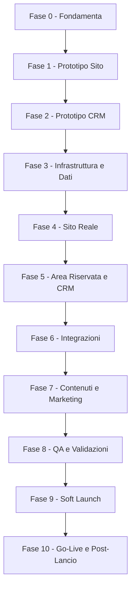

# Gestione Progetto - Fasi di Release e Step

> Piano di esecuzione a fasi con punti di approvazione (gate). Complementare al @13_Stima_Costi (che definisce l'ORDINE TECNICO di sviluppo): qui si governa il COME e QUANDO si rilascia, con prototipi e validazioni prima del go-live.
> Stato: In revisione · Ultimo aggiornamento: 2026-06-18
> Riferimenti: @13 (roadmap dev), @11 (sicurezza), @12 (operations), @10 (legale), DECISIONI.

## Principio dei "gate" (go / no-go)
Ogni fase ha un obiettivo, dei deliverable e un **criterio di uscita** che deve essere approvato prima di passare alla fase successiva. Questo evita di costruire sul vuoto e di scoprire problemi tardi.

## Legenda stati fase
- Da iniziare | In corso | In attesa di approvazione | Approvata

## Ruoli
- Lorenzo: fornisce informazioni, approva ai gate (contenuti, design, UX, legale, prezzi).
- Sviluppo (tu + AI): costruisce, testa, documenta.

## Flusso delle fasi

---

## Fase 0 - Fondamenta e raccolta info
- Obiettivo: avere tutti i prerequisiti prima di costruire.
- Deliverable: risposte di DOMANDE_PER_LORENZO; conferma abilitazione Entratel; incarico legale (privacy/T&C/DPIA, @10); asset brand (logo/foto) e shooting (@02/@09).
- Gate di uscita: prerequisiti legali e informativi raccolti; brand approvato.
- Stato: In corso

## Fase 1 - Prototipo Sito (validazione UX/design/copy)
- Obiettivo: validare esperienza, design e testi del sito pubblico PRIMA dello sviluppo completo.
- Deliverable: prototipo multipagina navigabile (home, tariffe, chi sono, form, FAQ) con contenuti reali ma senza backend.
- Tecnologia prototipo: DECISO -> mockup in Next.js + dati finti (evolve nel prodotto reale, no lavoro buttato).
- Gate di uscita: Lorenzo approva layout, flusso e copy.
- Stato: Da iniziare

## Fase 2 - Prototipo CRM (validazione flusso/usabilita)
- Obiettivo: validare interfaccia e flusso del CRM con dati finti.
- Deliverable: mockup di Kanban, scheda lavoro, anagrafica/storico, dashboard KPI (dati simulati).
- Gate di uscita: Lorenzo approva l'usabilita e conferma colonne/azioni/viste.
- Stato: Da iniziare

## Fase 3 - Infrastruttura e Dati
- Obiettivo: basi tecniche pronte (@13 step 1-3).
- Deliverable: ambienti dev/staging/prod, Supabase UE, schema + RLS + test cross-tenant, auth admin (2FA) e client passwordless.
- Gate di uscita: RLS testata (nessuna fuga cross-tenant, @11); CI/CD attiva.
- Stato: Da iniziare

## Fase 4 - Sito Reale
- Obiettivo: sito pubblico in produzione tecnica (non ancora pubblicizzato).
- Deliverable: pagine reali (da prototipo), form multi-step -> lead in DB + eventi GA4, checkout Stripe + webhook, pagine legali + CMP.
- Gate di uscita: flusso lead->pagamento funzionante in test; consensi e Consent Mode attivi (@08/@10).
- Stato: Da iniziare

## Fase 5 - Area Riservata e CRM
- Obiettivo: parte operativa funzionante.
- Deliverable: area cliente (upload/dashboard/download signed URL), CRM (Kanban, scheda lavoro, contacts/storico, validazione documenti, automazioni email, dashboard KPI base).
- Gate di uscita: ciclo completo pratica end-to-end in staging.
- Stato: Da iniziare

## Fase 6 - Integrazioni
- Obiettivo: automazioni complete.
- Deliverable: WhatsApp (se in v1), offline conversions, job/cron con retry, Looker Studio embeddato, Sentry.
- Gate di uscita: automazioni con retry verificate; alert attivi (@12).
- Stato: Da iniziare

## Fase 7 - Contenuti e Marketing
- Obiettivo: il "negozio" e pronto a ricevere traffico.
- Deliverable: 5 pillar article (accurati su autoliquidazione), schema.org, Google Business Profile, 20 recensioni iniziali, campagne Ads configurate (non ancora attive).
- Gate di uscita: contenuti pubblicati; tracciamento conversioni validato (@08).
- Stato: Da iniziare

## Fase 8 - QA e Validazioni
- Obiettivo: qualita e conformita prima del pubblico.
- Deliverable: checklist QA (@13), security review (@11), UAT con Lorenzo su dati reali, validazione legale finale, restore di prova del DB.
- Gate di uscita: checklist QA superata; legale approvato; backup/restore ok.
- Stato: Da iniziare

## Fase 9 - Soft Launch
- Obiettivo: validare in condizioni reali su scala ridotta.
- Deliverable: sito live con traffico limitato (budget Ads ridotto / cerchia ristretta); monitoraggio attivo.
- Gate di uscita: nessun bug bloccante; primi lead/pratiche gestiti correttamente.
- Stato: Da iniziare

## Fase 10 - Go-Live e Post-Lancio
- Obiettivo: lancio ufficiale e miglioramento continuo.
- Deliverable: scaling Ads sui dati (@09), manutenzione (@12), avvio funzioni fase 2 (OCR, export gestionale, ROI avanzato).
- Gate di uscita: -
- Stato: Da iniziare

---

## Decisione (congelata): tecnologia del prototipo (Fasi 1-2)
- DECISO: mockup statico in Next.js + dati finti, che evolve nel prodotto reale (no lavoro buttato).
- Scartate: Figma/clickable (solo visivo) e HTML statico separato (da rifare nello stack reale).

## Note
- Le fasi possono parzialmente sovrapporsi (es. contenuti SEO mentre si sviluppa il CRM), ma i gate restano vincolanti.
- Aggiornare lo "Stato" di ciascuna fase man mano che si avanza.
